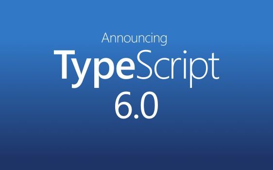

# 주간 AI 웹진 — 2026-03-25

> 기간: 2026-03-18 ~ 2026-03-25
> 수집 건수: 76

## 이번 주 요약

이번 주 AI 업데이트에서는 Anthropic의 Claude Code v2.1.81 업데이트가 주목받았습니다. 해당 업데이트는 코드 관련 성능 향상에 중점을 두었으며, 개발자 커뮤니티에서 심층

## LLM

### 1. OpenAI, GPT-5.1 출시... ’더 스마트하고 따뜻한’ 대화 지향 - Investing.com 한국어

`2026-03-25 | GOOGLENEWS | update`

[Investing.com 한국어] Thu, 13 Nov 2025 08:00:00 GMT

[원문 보기](https://news.google.com/rss/articles/CBMiakFVX3lxTE9Pci13bmZKelJsNXBTZzZsVkx0ZU1ZX1Nmb2RIZ1hhaTVMMkw0U0w0YzVwUmxxMnY3dVFIblJHb0xNa2FRVFZMZDNxQXhhdW5ZQ0xmc29pOVFXbDFrSFJlM3FRRTVqcFdpVGc?oc=5)

### 2. OpenAI, GPT-5.3 인스턴트 업데이트 공개 - 케이벤치

`2026-03-25 | GOOGLENEWS | update`

[케이벤치] Wed, 04 Mar 2026 01:01:42 GMT

[원문 보기](https://news.google.com/rss/articles/CBMiSEFVX3lxTE94X0l6TTJvY0NuYkRDVjdhQkZfQUs3Mk9rUFJWZDlWWThZYktEY2RlY093WWRTRHFqbWZwZ0wwMllhZnZVczlNNw?oc=5)

### 3. 향상된 Gemini 2.5 Flash 및 Flash-Lite 출시를 통해 계속해서 최신 모델 제공 - blog.google

`2026-03-25 | GOOGLENEWS | update`

[blog.google] Thu, 25 Sep 2025 07:00:00 GMT

[원문 보기](https://news.google.com/rss/articles/CBMi0gFBVV95cUxOTjJ4LWhiTUpnOWZaaFQtT3B2OWlqYkh2NGZ3T01TYW5penZnVXpzUThENkFMMDM1aHNheEFWalFDaFFyVFE4LV94SDRzTFdvaGQ3aTJaNGdUYXJnNDBBdFBvMFpreDdjZ1BiU2gyb3NrYUp0d3RfZWFSakxOU1p0RHN0VGtiZFJWd0wtOWYzMV8zaGtmazAzNVlFWVZQX1ZXcmIwQUhaRUtvQmZlc3AyWUgyVHYtN1o0dGp1TG9ENGplbFlhd2czaDZ1eXZPaGlFcEE?oc=5)

### 4. 앤쓰로픽, 최상위 AI 모델 '클로드 오퍼스 4.6' 공개…실무 성능 GPT-5.2 압도 - 테크수다

`2026-03-25 | GOOGLENEWS | update`

[테크수다] Fri, 06 Feb 2026 08:00:00 GMT

[원문 보기](https://news.google.com/rss/articles/CBMibkFVX3lxTE9sMjlHMGJLRHEyQUVlbXltTW5tQUJud3pzRDRhS0FxN2RORVAzamx4VXBPOVJFbUotMlpNNC1TRHhRdWdBWDQ1V2JQZVRqaEYtVkR4OTNKbXlULWZlaW90WE5YV0tmMVc2QW9vTzZ30gFzQVVfeXFMUG9ZcXVCZGZqd0NRWEVYSWlodzZPcUgxWml2TXFYVTBpQWV1MS05SDZMaDNpYjB3TGFUM3ZHbk5STmwyZVJmalEtMVNyaUVWZS1nTElEUGhlLWtOcXM2blgxWWF0V2phRjVzUWdTenJ1U0Itbw?oc=5)

### 5. Claude Code v2.1.81 업데이트 완벽 분석 - 브런치

`2026-03-25 | GOOGLENEWS | update`

[브런치] Sun, 22 Mar 2026 16:59:19 GMT

[원문 보기](https://news.google.com/rss/articles/CBMiTkFVX3lxTE5JN291OFpwSnJfWDFXOWJzREpuMjEwb1o0NGdMaVhxQzNlcDhPQW9heGY0dEhYenF0THBuV0ZWQ1d4VE0zS2drV20zbHZNUQ?oc=5)

## 에이전트/자동화

### 1. I spent 3 months trying to keep up with AI. Here’s why I stopped and what actually works instead.

`2026-03-25 | REDDIT | update`

I need to share something because I think a lot of people here are stuck in the same trap I was. For the last 3 months, I tried to keep up with everything in AI. Every tool. Every model update. Every startup launch. Every newsletter and thread and hot take. And I completely burned out on it. Not because I’m lazy. Becau...

[원문 보기](https://www.reddit.com/r/u_Big-Chair5030/comments/1s2xwv9/i_spent_3_months_trying_to_keep_up_with_ai_heres/)

### 2. Finance District core products are now live (Beta)

`2026-03-25 | REDDIT | update`

We’ve just pushed the first set of Finance District core products into Beta production. Everything is accessible through a single App Launcher, which acts as the entry point to the ecosystem. Currently live: * AI Assistant – interact with DeFi using natural-language prompts * MCP Server – infrastructure layer for agent...

[원문 보기](https://www.reddit.com/r/u_AgentAiLeader/comments/1s2y57a/finance_district_core_products_are_now_live_beta/)

### 3. Show HN: Budibase Agents Beta – model-agnostic AI agents for internal workflows

`2026-03-25 | HACKERNEWS | update`

https://budibase.com/blog/updates/ai-agents-beta/

[원문 보기](https://budibase.com/blog/updates/ai-agents-beta/)

### 4. How to Run Automation Safely✨

`2026-03-25 | REDDIT | trend`

Everyone's talking about AI agents right now, so let's break down how to actually choose one—and more importantly, how to run them without getting your accounts nuked. **First, figure out what you actually need.** What's your main goal? * Coding → Devin AI or Claude Code * Research → Perplexity * Automation → OpenClaw...

[원문 보기](https://www.reddit.com/r/AdsPower_Community/comments/1s2z17q/how_to_run_automation_safely/)

## XR/Spatial

### 1. Hegel, a universal property-based testing protocol and family of PBT libraries

`2026-03-25 | LOBSTERS | trend`

[원문 보기](https://hegel.dev)

### 2. "﷽" U+FDFD: ARABIC LIGATURE BISMILLAH AR-RAHMAN AR-RAHEEM (Unicode Character)

`2026-03-25 | LOBSTERS | trend`

[원문 보기](https://unicodeplus.com/U+FDFD)

## 기타

### 1. curl > dev/sda

`2026-03-25 | LOBSTERS | trend`

[원문 보기](https://astrid.tech/2026/03/24/0/curl-to-dev-sda/)

### 2. Debunking zswap and zram myths

`2026-03-25 | LOBSTERS | trend`

[원문 보기](https://chrisdown.name/2026/03/24/zswap-vs-zram-when-to-use-what.html)

### 3. Announcing TypeScript 6.0

`2026-03-25 | LOBSTERS | trend`

[원문 보기](https://devblogs.microsoft.com/typescript/announcing-typescript-6-0/)

### 4. Missile Defense is NP-Complete

`2026-03-25 | LOBSTERS | trend`

[원문 보기](https://smu160.github.io/posts/missile-defense-is-np-complete/)

### 5. Go Naming Conventions: A Practical Guide

`2026-03-25 | LOBSTERS | trend`

[원문 보기](https://www.alexedwards.net/blog/go-naming-conventions)
