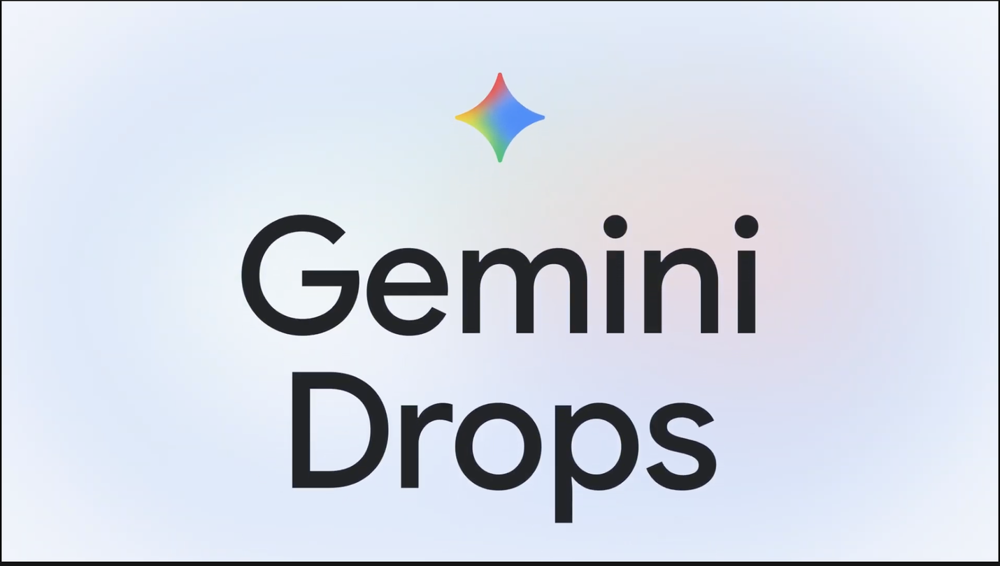

# 주간 AI 웹진 — 2026-03-28

> 이번 주 AI판, 속도전보다 워크플로 싸움이 더 뜨거웠습니다.

> 기간: 2026-03-21 ~ 2026-03-28
> 수집 건수: 18

## 이번 주 판세 요약

**이번 주는 새 모델이 튀어나온 것보다, 이미 있던 도구들이 어디까지 실무를 먹어치우는지가 더 또렷하게 보인 한 주였습니다.**

영상 생성 쪽에선 기존 세대 종료와 후속 경험 기본 전환이 공식화됐습니다. 중요한 건 특정 제품명보다도, 생성 툴들이 버전 교체를 더 빠르게 밀어붙이기 시작했다는 흐름입니다. 음악 생성 쪽에선 Suno가 입력, 리스타일링, 스타일 고정 기능을 한꺼번에 밀어 넣으면서 '한 곡 뽑기'보다 '내 작업물을 바로 이어 쓰기' 경쟁으로 판을 돌렸습니다.

### 세 줄 요약

- 이번 주 핵심은 신모델 공개보다 기존 워크플로를 갈아끼우는 변화였습니다.
- 음악·영상 생성 툴은 프롬프트 경쟁보다 내 소스와 자산을 바로 붙여 쓰는 쪽으로 움직였습니다.
- LLM 쪽은 성능 과시보다 도구 연결, 평가, 장기 실행 같은 실무 체력 강화가 더 선명했습니다.

## LLM

이번 주 LLM은 성능표보다 운영표가 더 중요해진 주간이었습니다.

### 1. Find out what’s new in the Gemini app in March's Gemini Drop.

`2026-03-27 | 공식 발표 | Google | update`

Google가 모델 자체보다 개발 워크플로 쪽에 더 가까운 공식 업데이트를 내놨습니다. 핵심은 여기서 갈립니다. 이쪽은 성능 숫자 자랑보다, 개발자가 도구를 어떻게 붙이고 일에 태우느냐가 더 중요해지는 흐름입니다.

> 감각적으로 옮기면 엔진 출력표보다, 자주 타는 차에 자동변속기를 달아 놓은 쪽에 더 가깝습니다.

[원문 보기](https://blog.google/innovation-and-ai/products/gemini-app/gemini-drop-updates-march-2026/)

### 2. Partnering with Mozilla to improve Firefox’s security

`2026-03-26 | 공식 발표 | Anthropic | update`

Anthropic가 모델 자체보다 개발 워크플로 쪽에 더 가까운 공식 업데이트를 내놨습니다. 작업하는 사람 입장에선 이쪽은 성능 숫자 자랑보다, 개발자가 도구를 어떻게 붙이고 일에 태우느냐가 더 중요해지는 흐름입니다.

> 쉽게 말해 엔진 출력표보다, 자주 타는 차에 자동변속기를 달아 놓은 쪽에 더 가깝습니다.

[원문 보기](https://www.anthropic.com/news/mozilla-firefox-security)

### 3. We’re partnering with multiple national teams ahead of soccer’s biggest global showdown.

`2026-03-26 | 공식 발표 | Google | update`

Google가 모델 자체보다 개발 워크플로 쪽에 더 가까운 공식 업데이트를 내놨습니다. 이걸 왜 보냐면 이쪽은 성능 숫자 자랑보다, 개발자가 도구를 어떻게 붙이고 일에 태우느냐가 더 중요해지는 흐름입니다.

> 감각적으로 옮기면 엔진 출력표보다, 자주 타는 차에 자동변속기를 달아 놓은 쪽에 더 가깝습니다.

[원문 보기](https://blog.google/company-news/inside-google/company-announcements/soccer-nationalteam-partnerships/)

### 짧게 보고 갈 것

- Make the switch: Bring your AI memories and chat history to Gemini (Google)
- Gemini 3.1 Flash Live: Making audio AI more natural and reliable (Google)
- Search Live is expanding globally (Google)
- Claude Code auto mode: a safer way to skip permissions (Anthropic)
- Lyria 3 Pro: Create longer tracks in more Google products (Google)
- Build with Lyria 3, our newest music generation model (Google)
- Harness design for long-running application development (Anthropic)
- 3 new Gemini features are coming to Google TV (Google)

## 이미지 생성

이미지 생성은 화질 과시보다 테스트를 얼마나 많이, 싸게 돌릴 수 있느냐가 더 큰 경쟁 포인트로 보였습니다.

### 1. Relax mode for V8 Alpha

`2026-03-21 | 공식 발표 | Midjourney | update`

Midjourney가 `V8 Alpha`에 저비용으로 많이 돌려볼 수 있는 `Relax mode`를 붙였습니다. 작업하는 사람 입장에선 이미지판에선 결과물 한 장보다 반복 실험 비용과 속도가 달라져 손이 더 자주 가는 쪽이 중요합니다.

> 감각적으로 옮기면 화질 자랑보다 필름값이 싸져서 테스트 컷을 훨씬 많이 찍게 되는 쪽에 가깝습니다.

[원문 보기](https://updates.midjourney.com/relax-mode-for-v8-alpha/)

## 영상 생성

영상 생성은 거창한 신기능 발표보다 버전 전환과 기존 작업 자산을 어떻게 이어갈지가 더 크게 보인 주간이었습니다.

### 1. Sora 1 Sunset – FAQ

`2026-03-16 | 공식 발표 | OpenAI | update`

OpenAI가 2026년 3월 13일부로 `Sora 1`을 미국에서 내리고, `Sora 2`를 기본 경험으로 돌렸습니다. 핵심은 여기서 갈립니다. 기존 버전에서 만든 자산이 있다면 내보내기 가능 기간, 호환성, 새 버전 적응 비용을 바로 체크해야 합니다.

> 쉽게 말해 같은 극장 간판 아래 영사기 세대가 통째로 바뀐 셈입니다.

[원문 보기](https://help.openai.com/en/articles/20001071-sora-1-sunset-faq)

## 음악 생성

음악 생성 쪽은 이번 주에 유독 방향이 선명했습니다. 프롬프트 한 줄 받아 곡을 뽑는 데서 끝나는 게 아니라, 내 파일과 스타일을 바로 들고 들어오게 만드는 쪽으로 확실히 꺾였습니다.

### 1. Introducing Covers

`2026-03-28 | 공식 발표 | Suno | update`

Suno가 내 오디오를 다른 결로 다시 입히는 `Covers` 베타를 공개했습니다. 작업하는 사람 입장에선 이건 프롬프트 한 줄 경쟁보다, 내 소스와 스타일을 바로 가져다 쓰는 워크플로 경쟁으로 넘어갔다는 뜻입니다.

> 쉽게 말해 빈 악보에 부탁하는 게 아니라, 내 작업 파일을 통째로 스튜디오에 들고 들어간 느낌입니다.

[원문 보기](https://suno.com/blog/covers)

### 2. Introducing Suno Scenes

`2026-03-28 | 공식 발표 | Suno | update`

Suno가 장면이나 사진 같은 시각 단서를 음악 출발점으로 쓰는 `Suno Scenes`를 내놨습니다. 핵심은 여기서 갈립니다. 이건 프롬프트 한 줄 경쟁보다, 내 소스와 스타일을 바로 가져다 쓰는 워크플로 경쟁으로 넘어갔다는 뜻입니다.

> 한 장면으로 바꾸면 빈 악보에 부탁하는 게 아니라, 내 작업 파일을 통째로 스튜디오에 들고 들어간 느낌입니다.

[원문 보기](https://suno.com/blog/introducing-suno-scenes)

### 3. Ensuring Content Integrity: Suno Partners with Audible Magic for User Uploads

`2026-03-28 | 공식 발표 | Suno | update`

Suno가 사용자 업로드를 다루는 과정에 저작권 식별 장치를 붙였습니다. 실제로는 생성 기능이 커질수록 저작권 검증과 업로드 안전장치가 같이 붙는 흐름도 더 강해집니다.

> 한 장면으로 바꾸면 멜로디 하나 얻는 수준이 아니라, 세션 파일에 자주 쓰는 악기 체인을 저장한 느낌입니다.

[원문 보기](https://suno.com/blog/suno-partners-with-audible-magic)

### 짧게 보고 갈 것

- Audio Inputs (Suno)
- Introducing Personas (Suno)

## 편집/제작

이번 주는 공식 채널 기준으로 굵직한 업데이트가 없었습니다.

## 3D

이번 주는 공식 채널 기준으로 굵직한 업데이트가 없었습니다.

## 에이전트/자동화

이번 주는 공식 채널 기준으로 굵직한 업데이트가 없었습니다.

## XR/Spatial

이번 주는 공식 채널 기준으로 굵직한 업데이트가 없었습니다.
