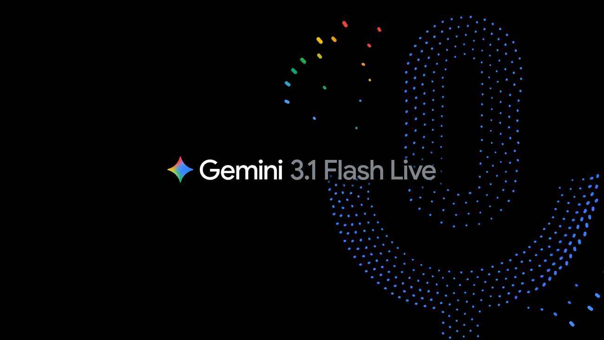
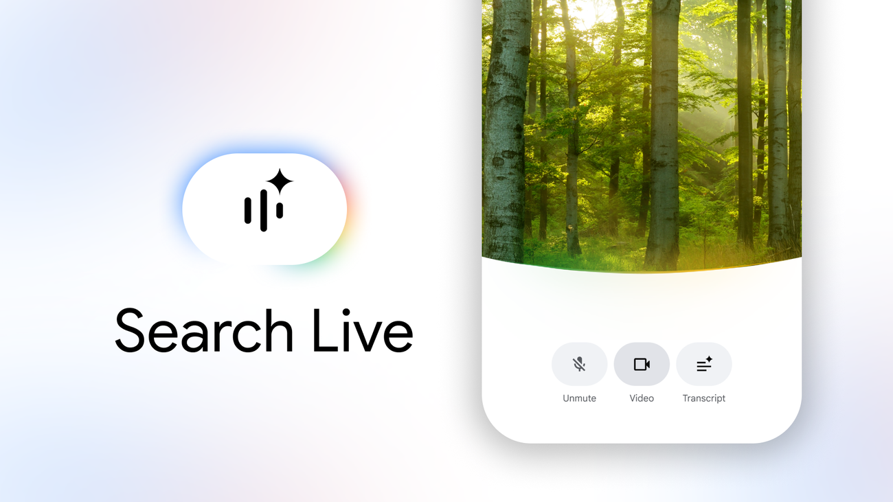
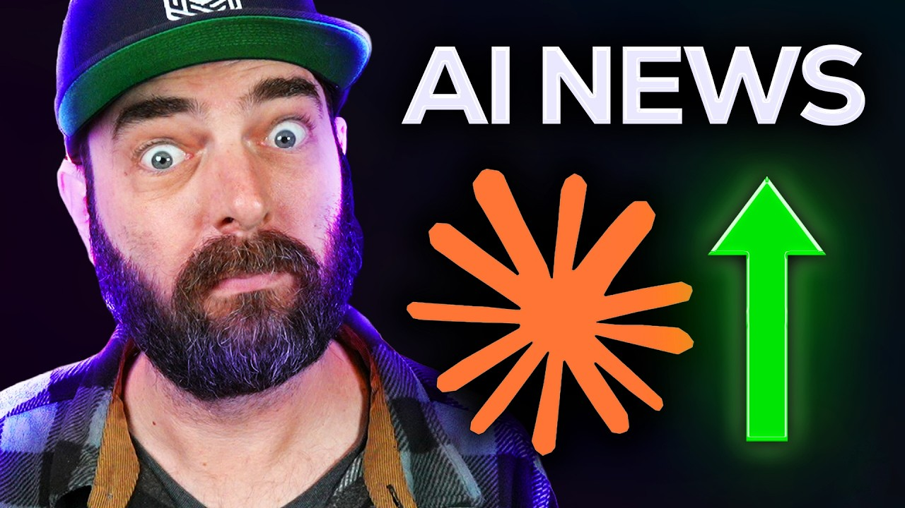

# 주간 AI 웹진 — 2026-03-29

> 이번 주 AI판, 속도전보다 워크플로 싸움이 더 뜨거웠습니다.

> 기간: 2026-03-22 ~ 2026-03-29
> 수집 건수: 15

## 이번 주 판세 요약

**이번 주는 새 모델이 튀어나온 것보다, 이미 있던 도구들이 어디까지 실무를 먹어치우는지가 더 또렷하게 보인 한 주였습니다.**

영상 생성 쪽에선 기존 세대 종료와 후속 경험 기본 전환이 공식화됐습니다. 중요한 건 특정 제품명보다도, 생성 툴들이 버전 교체를 더 빠르게 밀어붙이기 시작했다는 흐름입니다. 음악 생성 쪽에선 Suno가 입력, 리스타일링, 스타일 고정 기능을 한꺼번에 밀어 넣으면서 '한 곡 뽑기'보다 '내 작업물을 바로 이어 쓰기' 경쟁으로 판을 돌렸습니다.

### 세 줄 요약

- 이번 주 핵심은 신모델 공개보다 기존 워크플로를 갈아끼우는 변화였습니다.
- 음악·영상 생성 툴은 프롬프트 경쟁보다 내 소스와 자산을 바로 붙여 쓰는 쪽으로 움직였습니다.
- LLM 쪽은 성능 과시보다 도구 연결, 평가, 장기 실행 같은 실무 체력 강화가 더 선명했습니다.

## LLM

이번 주 LLM은 성능표보다 운영표가 더 중요해진 주간이었습니다.

### 1. Gemini 3.1 Flash Live: Making audio AI more natural and reliable

`2026-03-26 | 공식 발표 | Google | update`

Google가 음성 대화를 더 자연스럽고 빠르게 처리하는 `Gemini 3.1 Flash Live` 업데이트를 내놨습니다. 음성 모델이 빨라지고 덜 어색해질수록, 실시간 통역이나 보이스 인터페이스 같은 현장형 기능의 완성도가 바로 올라갑니다.

> 통역기 마이크를 바꿨더니, 대화가 한 박자 덜 끊기는 느낌에 가깝습니다.

[원문 보기](https://blog.google/innovation-and-ai/models-and-research/gemini-models/gemini-3-1-flash-live/)

### 2. Search Live is expanding globally

`2026-03-26 | 공식 발표 | Google | update`

Google가 대화형 검색 경험 `Search Live`를 글로벌로 넓히기 시작했습니다. 검색창이 링크 목록에서 대화형 안내석으로 바뀌는 흐름이 더 넓은 지역으로 퍼진다는 뜻입니다.

> 검색창 옆에 콜센터 상담원을 상주시켜 두는 쪽에 더 가깝습니다.

[원문 보기](https://blog.google/products-and-platforms/products/search/search-live-global-expansion/)

### 짧게 보고 갈 것

- Claude Code auto mode: a safer way to skip permissions (Anthropic)
- Lyria 3 Pro: Create longer tracks in more Google products (Google)
- Build with Lyria 3, our newest music generation model (Google)
- Harness design for long-running application development (Anthropic)
- Find out what’s new in the Gemini app in March's Gemini Drop. (Google)
- Make the switch: Bring your AI memories and chat history to Gemini (Google)
- 3 new Gemini features are coming to Google TV (Google)

## 영상 생성

영상 생성은 거창한 신기능 발표보다 버전 전환과 기존 작업 자산을 어떻게 이어갈지가 더 크게 보인 주간이었습니다.

### 1. Sora 1 Sunset – FAQ

`2026-03-17 | 공식 발표 | OpenAI | update`

OpenAI가 2026년 3월 13일부로 `Sora 1`을 미국에서 내리고, `Sora 2`를 기본 경험으로 돌렸습니다. 기존 버전에서 만든 자산이 있다면 내보내기 가능 기간, 호환성, 새 버전 적응 비용을 바로 체크해야 합니다.

> 같은 극장 간판 아래 영사기 세대가 통째로 바뀐 셈입니다.

[원문 보기](https://help.openai.com/en/articles/20001071-sora-1-sunset-faq)

## 음악 생성

음악 생성 쪽은 이번 주에 유독 방향이 선명했습니다. 프롬프트 한 줄 받아 곡을 뽑는 데서 끝나는 게 아니라, 내 파일과 스타일을 바로 들고 들어오게 만드는 쪽으로 확실히 꺾였습니다.

### 1. Introducing Covers

`2026-03-29 | 공식 발표 | Suno | update`

Suno가 내 오디오를 다른 결로 다시 입히는 `Covers` 베타를 공개했습니다. 이건 프롬프트 한 줄 경쟁보다, 내 소스와 스타일을 바로 가져다 쓰는 워크플로 경쟁으로 넘어갔다는 뜻입니다.

> 빈 악보에 부탁하는 게 아니라, 내 작업 파일을 통째로 스튜디오에 들고 들어간 느낌입니다.

[원문 보기](https://suno.com/blog/covers)

### 2. Introducing Suno Scenes

`2026-03-29 | 공식 발표 | Suno | update`

Suno가 장면이나 사진 같은 시각 단서를 음악 출발점으로 쓰는 `Suno Scenes`를 내놨습니다. 이건 프롬프트 한 줄 경쟁보다, 내 소스와 스타일을 바로 가져다 쓰는 워크플로 경쟁으로 넘어갔다는 뜻입니다.

> 빈 악보에 부탁하는 게 아니라, 내 작업 파일을 통째로 스튜디오에 들고 들어간 느낌입니다.

[원문 보기](https://suno.com/blog/introducing-suno-scenes)

### 짧게 보고 갈 것

- Ensuring Content Integrity: Suno Partners with Audible Magic for User Uploads (Suno)
- Audio Inputs (Suno)
- Introducing Personas (Suno)

## 지금 많이 보는 AI 유튜브

이번 주 이슈랑 같이 보면 맥락 잡기 좋은 영상 3개만 골랐습니다. 뉴스형 브리핑 위주로 넣었습니다.

### 1. AI News: Anthropic Went Crazy This Week!

`2026-03-27 | YouTube | Matt Wolfe | 6.4만회`

이번 주 웹진에서 다룬 Anthropic 흐름을 같이 훑기 좋은 영상입니다.

[원문 보기](https://www.youtube.com/watch?v=OYyS0Gu5xj8)

### 2. AI News: Gemini Is SO Much Better Now (+ NotebookLM, Claude and Siri Updates)

`2026-03-28 | YouTube | Paul J Lipsky | 6.1천회`

이번 주 웹진에서 다룬 Claude, Gemini 흐름을 같이 훑기 좋은 영상입니다.

[원문 보기](https://www.youtube.com/watch?v=jWNlxQQ_W_Q)
