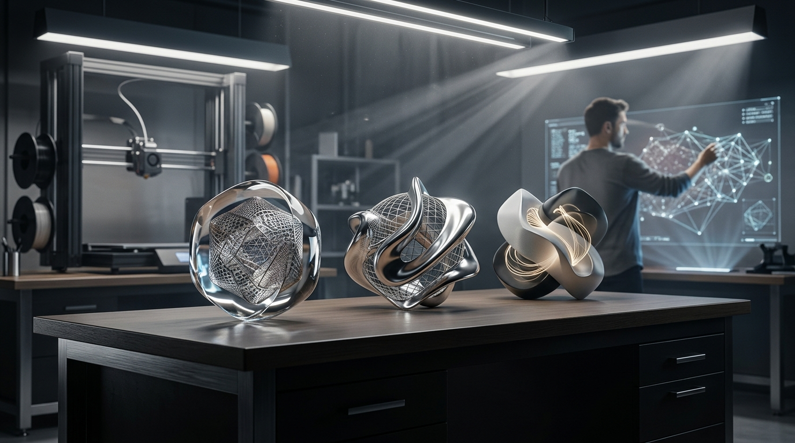
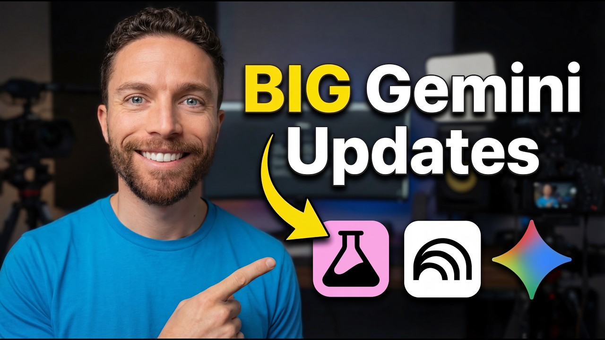

# 주간 AI 웹진 — 2026-03-29

> 이번 주 AI판, 속도전보다 워크플로 싸움이 더 뜨거웠습니다.

> 기간: 2026-03-22 ~ 2026-03-29
> 수집 건수: 55

## 이번 주 판세 요약

**이번 주는 새 모델이 튀어나온 것보다, 이미 있던 도구들이 어디까지 실무를 먹어치우는지가 더 또렷하게 보인 한 주였습니다.**

영상 생성 쪽에선 기존 세대 종료와 후속 경험 기본 전환이 공식화됐습니다. 중요한 건 특정 제품명보다도, 생성 툴들이 버전 교체를 더 빠르게 밀어붙이기 시작했다는 흐름입니다. 음악 생성 쪽에선 Suno가 입력, 리스타일링, 스타일 고정 기능을 한꺼번에 밀어 넣으면서 '한 곡 뽑기'보다 '내 작업물을 바로 이어 쓰기' 경쟁으로 판을 돌렸습니다.

### 세 줄 요약

- 이번 주 핵심은 신모델 공개보다 기존 워크플로를 갈아끼우는 변화였습니다.
- 음악·영상 생성 툴은 프롬프트 경쟁보다 내 소스와 자산을 바로 붙여 쓰는 쪽으로 움직였습니다.
- LLM 쪽은 성능 과시보다 도구 연결, 평가, 장기 실행 같은 실무 체력 강화가 더 선명했습니다.

## LLM

이번 주 LLM은 성능표보다 운영표가 더 중요해진 주간이었습니다.

### 1. Gemini 3.1 Flash Live: Making audio AI more natural and reliable

`2026-03-26 | 공식 발표 | Google | update`

Google은 최신 오디오 모델인 Gemini 3.1 Flash Live를 공개합니다. 이 모델은 향상된 정확도와 낮은 지연 시간으로 실시간 음성 상호작용을 더욱 유연하고 자연스러우며 정밀하게 만듭니다.

> 엔진 출력표보다, 자주 타는 차에 자동변속기를 달아 놓은 쪽에 더 가깝습니다.

[원문 보기](https://blog.google/innovation-and-ai/models-and-research/gemini-models/gemini-3-1-flash-live/)

### 2. Search Live is expanding globally

`2026-03-26 | 공식 발표 | Google | update`

구글은 AI 모드에서 상호작용적 다중 모드 대화를 가능하게 하는 'Search Live' 기능을 확대했습니다. 이 기능은 전 세계 200개국 이상, AI 모드가 제공되는 모든 언어 및 지역으로 확대 적용됩니다.

> 엔진 출력표보다, 자주 타는 차에 자동변속기를 달아 놓은 쪽에 더 가깝습니다.

[원문 보기](https://blog.google/products-and-platforms/products/search/search-live-global-expansion/)

### 짧게 보고 갈 것

- Claude Code auto mode: a safer way to skip permissions (Anthropic)
- Lyria 3 Pro: Create longer tracks in more Google products (Google)
- Build with Lyria 3, our newest music generation model (Google)
- Harness design for long-running application development (Anthropic)
- Find out what’s new in the Gemini app in March's Gemini Drop. (Google)
- Make the switch: Bring your AI memories and chat history to Gemini (Google)
- 3 new Gemini features are coming to Google TV (Google)
- Google's new Gemini update makes it easy to import memories from ChatGPT and Claude (The Decoder)
- Gemini Drops: New updates to the Gemini app, March 2026 (Google)
- Show HN: Open-Source Animal Crossing–Style UI for Claude Code Agents (ZeidJ)
- Claude can control your computer now, openclaw and zenmux updated same day (u/44th--Hokage)
- From a ChatGPT Concept to 18k Gold & Natural Diamonds: My incredible custom jewelry experience. (u/Dj-Viktor)
- I built an AI that actually remembers my kitchen and tells me what to cook (u/koob23)
- Noisy - a free, ultra-efficient noise generator (u/iccir)
- The Digital Hearts - Perfect Exposure (ChatGPT + Human Art) (u/Kitty-Marks)
- AI Agents are breaking in production. Why I Built an Execution-Layer Firewall. (u/Mission2Infinity)
- What does your AI “Jarvis” app do? (u/Banana_Pankcakes)
- OpenAI indefinitely pauses plans to release erotic chatbot (bhouston)
- OpenAI drops plans to release an adult chatbot (thm)
- AI JUST CHANGED AGAIN — BIG UPDATES! (u/Friendly-Beyond1787)
- Gemini 3 Pro Image Preview API 가격: 최신 공식 비용과 업그레이드 기준 - 현재 API 단가, batch 비용, 결제 주의점, Pro 업그레이드 기준 | AI Free API (AI Free API)
- Apple Plans to Open Up Siri to Rival AI Assistants in iOS 27 Update (marc__1)
- OpenAI는 편견 결함을 수정하고 중립성을 보장하기 위해 ChatGPT에 대한 주요 업데이트를 준비합니다. - mixvale.com.br (mixvale.com.br)
- The content problem nobody talks about: AI doesn't know your product (u/Usama_Kashif)
- ChatGPT doesn't obey settings prompt (u/OddPollution7904)
- Most AI monetization hype is fake: Here's my 90-day workflow generating $350/mo with AI writing & niche sites (no coding) 💰 (u/liveitupdeals)
- I understand why leaders are nervous about hooking their business data into AI (u/Ok_Barber_9280)
- Introducing AI Smart Albums in Liquid Gallery – auto-organizes photos without cloud (u/knightman1995)
- Launch HN: Sitefire (YC W26) – Automating actions to improve AI visibility (vincko)
- Show HN: Budibase Agents Beta – model-agnostic AI agents for internal workflows (mjashanks)
- Claude Code v2.1.81 업데이트 완벽 분석 - brunch.co.kr (brunch.co.kr)
- Claude Code v2.1.81 업데이트 완벽 분석 - 브런치 (브런치)

## 이미지 생성

이미지 생성은 화질 과시보다 테스트를 얼마나 많이, 싸게 돌릴 수 있느냐가 더 큰 경쟁 포인트로 보였습니다.

### 1. Midjourney 8 vs 7: Why AI Creators Are Switching Back - Geeky Gadgets

`2026-03-24 | 웹 검색 | Geeky Gadgets | update`

Midjourney 8 Alpha가 기본 2K 해상도 모드를 포함한 여러 업데이트를 공개했지만, AI 예술 커뮤니티에서는 이에 대한 반응이 엇갈리고 있습니다. 새로운 기능이 추가되었음에도 일부 AI 창작자들이 Midjourney 7로 되돌아가는 현상이 나타나고 있습니다.

> 이는 단순히 새로운 버전의 미완성 때문이 아니라, 기존 워크플로우와의 불일치나 특정 스타일 선호도 때문일 수 있습니다.

[원문 보기](https://www.geeky-gadgets.com/midjourney-8/)

### 2. Generative credits FAQ

`2026-03-23 | 웹 검색 | Adobe | update`

Adobe는 자사 이미지 생성 AI인 Firefly의 '생성 크레딧(Generative credits)' 추가 구매 플랜에 대한 업데이트된 정보를 FAQ 형태로 배포했습니다. 이는 사용자들이 AI 이미지 생성에 필요한 자원을 어떻게 확보하고 관리할지에 대한 명확한 지침을 제공하며, 창작 활동의 효율성과 비용 구조에 직접적인 변화를 가져올 것입니다.

> 필요한 만큼의 재료를 구매하여 요리하는 것과 같습니다.

[원문 보기](https://helpx.adobe.com/creative-cloud/apps/generative-ai/generative-credits-faq.html)

### 짧게 보고 갈 것

- Adobe Firefly AI adds model to train with user's images - Televisual (Televisual)

## 영상 생성

영상 생성은 거창한 신기능 발표보다 버전 전환과 기존 작업 자산을 어떻게 이어갈지가 더 크게 보인 주간이었습니다.

### 1. Sora 1 Sunset – FAQ

`2026-03-17 | 공식 발표 | OpenAI | update`

OpenAI는 2026년 3월 13일부로 미국 내 Sora 1 서비스 제공을 종료했으며, 이제 미국 사용자들은 기본적으로 Sora 2를 사용하게 되었습니다. 이러한 변화는 인공지능 영상 생성 기술이 끊임없이 발전하며, 사용자에게 항상 최신 버전을 제공하는 방향으로 빠르게 전환되고 있음을 시사합니다.

> 이는 마치 구형 소프트웨어가 최신 버전으로 자동 업데이트되어 사라지는 과정과 흡사합니다.

[원문 보기](https://help.openai.com/en/articles/20001071-sora-1-sunset-faq)

### 2. Update OpSkyBlock - Reset | March the 20th 2026 | PikaNetwork

`2026-03-23 | 웹 검색 | PikaNetwork | update`

PikaNetwork는 2026년 3월 20일 OpSkyBlock 서비스의 리셋 업데이트를 예고했습니다. OpSkyBlock 환경이 초기화되면서 새로운 게임 플레이와 창의적인 도전이 가능해질 것입니다.

> 짧은 티저 한 편보다 편집실 타임라인에 새 레일을 깔아준 셈입니다.

[원문 보기](https://pika-network.net/opskyblock-reset/)

## 음악 생성

음악 생성 쪽은 이번 주에 유독 방향이 선명했습니다. 프롬프트 한 줄 받아 곡을 뽑는 데서 끝나는 게 아니라, 내 파일과 스타일을 바로 들고 들어오게 만드는 쪽으로 확실히 꺾였습니다.

### 1. Introducing Covers

`2026-03-29 | 공식 발표 | Suno | update`

AI 음악 생성 플랫폼 Suno가 신규 기능 'Covers'를 얼리 액세스 베타로 공개했습니다. 이 기능은 사용자가 음성 메모나 완성된 곡을 재탄생시킬 수 있도록 돕습니다.

> 원본 멜로디는 그대로 유지하면서도 완전히 다른 스타일로.

[원문 보기](https://suno.com/blog/covers)

### 2. Introducing Suno Scenes

`2026-03-29 | 공식 발표 | Suno | update`

Suno 팀은 새로운 기능 'Suno Scenes'를 공개하며, 사용자가 카메라로 찍은 사진이나 영상으로 직접 음악을 만들 수 있게 했습니다. 이제 텍스트나 오디오 입력에 더해 시각적 경험까지 음악 창작의 영역으로 들어오면서, 누구나 일상 속 순간들을 훨씬 더 다채로운 방식으로 소리화할 수 있는 길이 열렸습니다.

> 눈으로 본 풍경이 귀로 듣는 멜로디로 자연스럽게 피어나는 셈입니다.

[원문 보기](https://suno.com/blog/introducing-suno-scenes)

### 짧게 보고 갈 것

- Ensuring Content Integrity: Suno Partners with Audible Magic for User Uploads (Suno)
- Audio Inputs (Suno)
- Introducing Personas (Suno)
- Suno v5.5: More Expressive. More You. – Suno (Suno AI)

## 편집/제작

편집/제작 쪽은 새 버튼 하나보다 실제 반복 공정을 얼마나 덜어주느냐가 포인트입니다.

### 1. Partner models in Adobe products

`2026-03-24 | 웹 검색 | Adobe | update`

Adobe는 최근 업데이트를 통해 Adobe Firefly의 이미지 생성, 비디오 생성, Firefly 비디오 편집기, 보드 기능에 파트너 모델을 도입했습니다. Adobe Express, Adobe Illustrator, Adobe Photoshop에도 파트너 모델이 도입되었습니다.

> 새 버튼 하나보다 반복 클릭을 매크로로 묶어버린 쪽에 더 가깝습니다.

[원문 보기](https://helpx.adobe.com/creative-cloud/apps/generative-ai/non-adobe-models-in-adobe-products.html)

## 3D

3D 쪽은 멋진 결과물보다 후속 수정과 파이프라인 연결이 더 중요해진 흐름입니다.

### 1. 3D 에셋 생성 고도화 이끈 Tripo AI P1.0, GDC 2026 공개...

`2026-03-25 | 웹 검색 | Aitoolsbee | update`

Tripo AI P1.0은 GDC 2026 공개를 앞두고 입력 정렬, 기하 정확도, 텍스처 품질을 개선하여 캐릭터나 메카닉 같은 복잡한 3D 자산의 시각적 일관성을 높이고 대규모 상호연결된 환경을 지원합니다. 이러한 발전은 복잡한 캐릭터와 방대한 가상 세계를 이전보다 훨씬 쉽게 구축하게 만들어, 게임 및 메타버스 콘텐츠 제작의 문턱을 낮추고 전반적인 시각적 완성도를 끌어올릴 것입니다.

> 마치 정교한 조립식 블록으로 거대한 도시를 오차 없이 쌓아 올리는 것과 같습니다.

[원문 보기](https://aitoolsbee.com/ko/news/3d-%ec%97%90%ec%85%8b-%ec%83%9d%ec%84%b1-%ea%b3%a0%eb%8f%84%ed%99%94-%ec%9d%b4%eb%81%88-tripo-ai-p1-0-gdc-2026-%ea%b3%b5%ea%b0%9c/)

### 2. Bambu Lab Integrates Meshy 6 into MakerLab, Expanding AI Image-to-3D Capabilities « Fabbaloo

`2026-03-26 | 웹 검색 | Fabbaloo | trend`

Fabbaloo 쪽에서 이번 주 흐름을 보여주는 공식 업데이트가 나왔습니다. 3D 쪽 변화는 샘플 한 장보다 모델 정리, 후속 수정, 파이프라인 연결 편의성으로 드러납니다.

> 멋진 렌더 한 장보다, 모델링 책상 위에 손이 덜 가는 공구를 올린 셈입니다.

[원문 보기](https://www.fabbaloo.com/news/bambu-lab-integrates-meshy-6-into-makerlab-expanding-ai-image-to-3d-capabilities)

### 짧게 보고 갈 것

- Tripo AI Introduces Smart Mesh P1.0, Defining a New Phase for AI 3D Production (Barchart)
- Tripo AI Introduces H3.1, Advancing High-Fidelity AI 3D Generation for Production - TechBullion (TechBullion)

## 에이전트/자동화

에이전트/자동화는 데모보다 실제로 어디까지 맡길 수 있느냐가 핵심입니다.

### 1. InsAIts updates, build with Claude, Pro plan

`2026-03-29 | 커뮤니티 레이더 | u/YUYbox | update`

InsAIts v3.4.0 업데이트는 출시 이래 가장 큰 사용성 개선을 가져왔습니다. 에이전트 영역은 데모보다 실제 워크플로에 몇 단계까지 맡길 수 있느냐가 승부처입니다.

> 똑똑한 비서 한 명보다, 자주 하던 심부름에 전용 동선을 깔아 놓은 느낌입니다.

[원문 보기](https://www.reddit.com/r/ClaudeAI/comments/1s64rfn/insaits_updates_build_with_claude_pro_plan/)

### 2. VS Code 1.112 and 1.113: weekly releases, integrated browser debugging, Copilot CLI agent permissions, MCP server sandboxing – 4sysops

`2026-03-25 | 웹 검색 | 4sysops | update`

VS Code 1.112와 1.113 버전에서는 통합 브라우저 디버깅, Copilot CLI 에이전트 권한 설정, MCP 서버 샌드박싱 등 여러 기능이 추가되었습니다. 개발 환경이 더욱 통합되고 인공지능 도구의 보안과 제어 기능이 강화되면서, 개발자들은 더 효율적이고 안전하게 작업할 수 있는 흐름으로 나아가고 있습니다.

> 이러한 변화는 마치 여러 전문 도구를 한 곳에 모아두고 안전장치까지 꼼꼼히 갖춘 작업대와 같습니다.

[원문 보기](https://4sysops.com/archives/vs-code-1112-and-1113-weekly-releases-integrated-browser-debugging-copilot-cli-agent-permissions-mcp-server-sandboxing/)

### 짧게 보고 갈 것

- Alibaba International Launches Accio Work, an Enterprise AI Agent for Global Businesses (PR Newswire)
- I spent 3 months trying to keep up with AI. Here’s why I stopped and what actually works instead. (u/Big-Chair5030)
- SOCRadar Launches AI Agent Marketplace and Identity Intelligence to Combat Identity-Driven Cyberattacks (Yahoo! Finance)

## 지금 많이 보는 AI 유튜브

이번 주 이슈랑 같이 보면 맥락 잡기 좋은 영상 3개만 골랐습니다. 뉴스형 브리핑 위주로 넣었습니다.

### 1. AI News: Anthropic Went Crazy This Week!

`2026-03-27 | YouTube | Matt Wolfe | 6.6만회`

이번 주 웹진에서 다룬 Anthropic 흐름을 같이 훑기 좋은 영상입니다.

[원문 보기](https://www.youtube.com/watch?v=OYyS0Gu5xj8)

### 2. AI News: Gemini Is SO Much Better Now (+ NotebookLM, Claude and Siri Updates)

`2026-03-28 | YouTube | Paul J Lipsky | 8.6천회`

이번 주 웹진에서 다룬 Claude, Gemini 흐름을 같이 훑기 좋은 영상입니다.

[원문 보기](https://www.youtube.com/watch?v=jWNlxQQ_W_Q)

### 3. Incredible Google AI Updates From The Past Week (NotebookLM, Pomelli, Gemini…)

`2026-03-15 | YouTube | Paul J Lipsky | 7.2만회`

이번 주 웹진에서 다룬 Gemini 흐름을 같이 훑기 좋은 영상입니다.

[원문 보기](https://www.youtube.com/watch?v=dLLFeV-Gvgs)
