# 주간 AI 웹진 — 2026-04-04

> 이번 주 AI판, 속도전보다 워크플로 싸움이 더 뜨거웠습니다.

> 기간: 2026-03-28 ~ 2026-04-04
> 수집 건수: 95

## 이번 주 판세 요약

**이번 주는 새 모델이 튀어나온 것보다, 이미 있던 도구들이 어디까지 실무를 먹어치우는지가 더 또렷하게 보인 한 주였습니다.**

영상 생성 쪽에선 기존 세대 종료와 후속 경험 기본 전환이 공식화됐습니다. 중요한 건 특정 제품명보다도, 생성 툴들이 버전 교체를 더 빠르게 밀어붙이기 시작했다는 흐름입니다. LLM 진영은 성능 숫자보다 도구 연결, 평가, 장기 실행 같은 실무 레이어를 두껍게 만드는 쪽으로 움직였습니다.

### 세 줄 요약

- 이번 주 핵심은 신모델 공개보다 기존 워크플로를 갈아끼우는 변화였습니다.
- 음악·영상 생성 툴은 프롬프트 경쟁보다 내 소스와 자산을 바로 붙여 쓰는 쪽으로 움직였습니다.
- LLM 쪽은 성능 과시보다 도구 연결, 평가, 장기 실행 같은 실무 체력 강화가 더 선명했습니다.

## LLM

이번 주 LLM은 성능표보다 운영표가 더 중요해진 주간이었습니다.

### 1. Build with Veo 3.1 Lite, our most cost-effective video generation model

`2026-03-31 | 공식 발표 | Google | update`

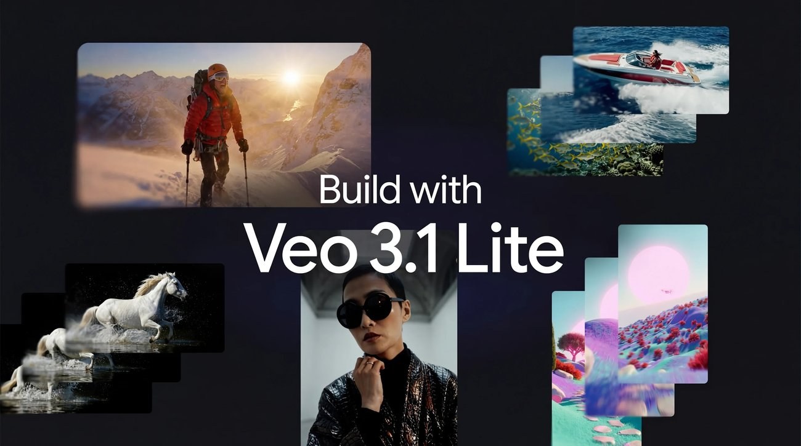

Google이 Gemini API를 통해 새로운 영상 생성 모델인 Veo 3.1 Lite를 개발자들에게 공개했습니다. 이 모델은 기존 Veo 3.1 Fast 대비 50% 미만의 비용으로 동일한 속도를 제공합니다.

> 가장 비용 효율적인 솔루션으로 소개됩니다.

[원문 보기](https://blog.google/innovation-and-ai/technology/ai/veo-3-1-lite/)

### 2. Gemma 4: Byte for byte, the most capable open models

`2026-04-02 | 공식 발표 | Google | update`

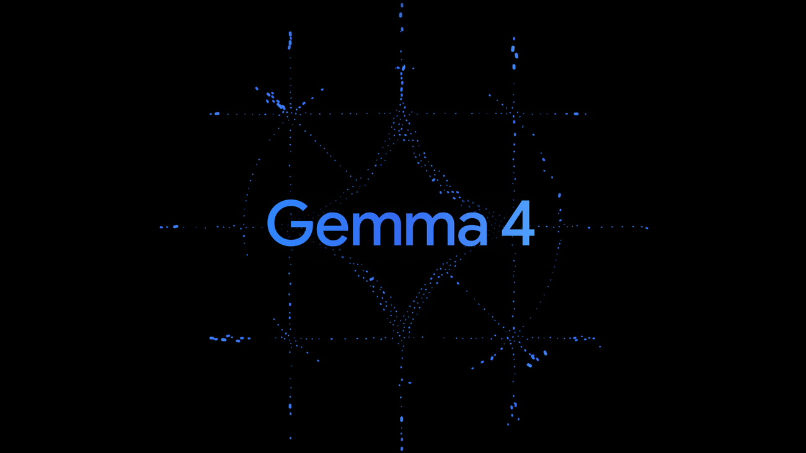

Google가 모델 자체보다 개발 워크플로 쪽에 더 가까운 공식 업데이트를 내놨습니다. 이쪽은 성능 숫자 자랑보다, 개발자가 도구를 어떻게 붙이고 일에 태우느냐가 더 중요해지는 흐름입니다.

> 엔진 출력표보다, 자주 타는 차에 자동변속기를 달아 놓은 쪽에 더 가깝습니다.

[원문 보기](https://blog.google/innovation-and-ai/technology/developers-tools/gemma-4/)

### 추가로 본 이슈

- 모델 자체보다 개발 워크플로 쪽에 더 가까운 공식 업데이트를 내놨습니다 (Google)
- 모델 자체보다 개발 워크플로 쪽에 더 가까운 공식 업데이트를 내놨습니다 (Anthropic)
- 모델 자체보다 개발 워크플로 쪽에 더 가까운 공식 업데이트를 내놨습니다 (Google)
- 모델 자체보다 개발 워크플로 쪽에 더 가까운 공식 업데이트를 내놨습니다 (Google)
- 이번 달 `Gemini` 앱에서 체감되는 신기능 묶음을 한 번에 정리했습니다 (Google)
- Do CarPlay 도착했다 ChatGPT어떤 모습인지, 어떤 기능을 하는지 확인해 보세요! - Letem světem Applem (Letem světem Applem)
- ChatGPT, 음성 전용 경험으로 CarPlay에 출시된 최초의 주요 AI 앱이 되다 - marketingtrending.asoworld.com (marketingtrending.asoworld.com)
- ChatGPT, 음성 전용 경험으로 CarPlay에 출시된 최초의 주요 AI 앱이 되다 - ASO World (ASO World)
- OpenAI, Anthropic의 Claude Code 내부에서 실행되는 Codex 플러그인 출시 - Unite.AI (Unite.AI)
- 모델 자체보다 개발 워크플로 쪽에 더 가까운 공식 업데이트를 내놨습니다 (The Decoder)
- 핸드폰으로 회사에 있는 클로드에게 미리 명령하세요 - 브런치 (브런치)
- 핸드폰으로 회사에 있는 클로드에게 미리 명령하세요 - brunch.co.kr (brunch.co.kr)
- 모델 자체보다 개발 워크플로 쪽에 더 가까운 공식 업데이트를 내놨습니다 (LLM Leaderboard)
- 모델 자체보다 개발 워크플로 쪽에 더 가까운 공식 업데이트를 내놨습니다 (kmjournal.net)
- 모델 자체보다 개발 워크플로 쪽에 더 가까운 공식 업데이트를 내놨습니다 (eWEEK)
- 모델 자체보다 개발 워크플로 쪽에 더 가까운 공식 업데이트를 내놨습니다 (Digital Trends)
- 모델 자체보다 개발 워크플로 쪽에 더 가까운 공식 업데이트를 내놨습니다 (XDA Developers)
- 모델 자체보다 개발 워크플로 쪽에 더 가까운 공식 업데이트를 내놨습니다 (u/1102bot)
- 모델 자체보다 개발 워크플로 쪽에 더 가까운 공식 업데이트를 내놨습니다 (u/Numbthumbs)
- 모델 자체보다 개발 워크플로 쪽에 더 가까운 공식 업데이트를 내놨습니다 (u/dorukyelken)
- 모델 자체보다 개발 워크플로 쪽에 더 가까운 공식 업데이트를 내놨습니다 (u/kaysersoze76)
- 모델 자체보다 개발 워크플로 쪽에 더 가까운 공식 업데이트를 내놨습니다 (u/Over_Advisor_6976)
- 모델 자체보다 개발 워크플로 쪽에 더 가까운 공식 업데이트를 내놨습니다 (u/RaselMahadi)
- 모델 자체보다 개발 워크플로 쪽에 더 가까운 공식 업데이트를 내놨습니다 (u/sanumala)
- 모델 자체보다 개발 워크플로 쪽에 더 가까운 공식 업데이트를 내놨습니다 (u/enoumen)
- 모델 자체보다 개발 워크플로 쪽에 더 가까운 공식 업데이트를 내놨습니다 (u/OldConstruction7682)
- 모델 자체보다 개발 워크플로 쪽에 더 가까운 공식 업데이트를 내놨습니다 (u/vivaladav)
- 모델 자체보다 개발 워크플로 쪽에 더 가까운 공식 업데이트를 내놨습니다 (u/Demonbae_)
- 모델 자체보다 개발 워크플로 쪽에 더 가까운 공식 업데이트를 내놨습니다 (u/Distinct_Track_5495)
- 모델 자체보다 개발 워크플로 쪽에 더 가까운 공식 업데이트를 내놨습니다 (u/raw-shan)
- 모델 자체보다 개발 워크플로 쪽에 더 가까운 공식 업데이트를 내놨습니다 (u/MainGroundbreaking96)
- 모델 자체보다 개발 워크플로 쪽에 더 가까운 공식 업데이트를 내놨습니다 (u/captainjackrana)
- 모델 자체보다 개발 워크플로 쪽에 더 가까운 공식 업데이트를 내놨습니다 (u/Objective_Farm_1886)
- 모델 자체보다 개발 워크플로 쪽에 더 가까운 공식 업데이트를 내놨습니다 (u/shuvooooooooo)
- 모델 자체보다 개발 워크플로 쪽에 더 가까운 공식 업데이트를 내놨습니다 (u/jalebi_bhaiii)
- 모델 자체보다 개발 워크플로 쪽에 더 가까운 공식 업데이트를 내놨습니다 (u/SnooWoofers7340)
- 모델 자체보다 개발 워크플로 쪽에 더 가까운 공식 업데이트를 내놨습니다 (u/Professional-Bad2785)
- 모델 자체보다 개발 워크플로 쪽에 더 가까운 공식 업데이트를 내놨습니다 (u/Comprehensive_Bad_77)
- 모델 자체보다 개발 워크플로 쪽에 더 가까운 공식 업데이트를 내놨습니다 (u/ClaudeAI-mod-bot)
- 모델 자체보다 개발 워크플로 쪽에 더 가까운 공식 업데이트를 내놨습니다 (u/Available-Time-6642)
- 모델 자체보다 개발 워크플로 쪽에 더 가까운 공식 업데이트를 내놨습니다 (u/OperaNeonOfficial)
- 모델 자체보다 개발 워크플로 쪽에 더 가까운 공식 업데이트를 내놨습니다 (u/Flashy_Test_8927)
- 모델 자체보다 개발 워크플로 쪽에 더 가까운 공식 업데이트를 내놨습니다 (u/Savings-Arrival-7817)
- 모델 자체보다 개발 워크플로 쪽에 더 가까운 공식 업데이트를 내놨습니다 (u/Ill_Distribution8517)
- 모델 자체보다 개발 워크플로 쪽에 더 가까운 공식 업데이트를 내놨습니다 (u/chiruwonder)
- 모델 자체보다 개발 워크플로 쪽에 더 가까운 공식 업데이트를 내놨습니다 (u/Med-donsadek11)
- 모델 자체보다 개발 워크플로 쪽에 더 가까운 공식 업데이트를 내놨습니다 (u/mad_ka_shit)
- 모델 자체보다 개발 워크플로 쪽에 더 가까운 공식 업데이트를 내놨습니다 (u/Friendly-Beyond1787)
- 모델 자체보다 개발 워크플로 쪽에 더 가까운 공식 업데이트를 내놨습니다 (ZeidJ)
- 모델 자체보다 개발 워크플로 쪽에 더 가까운 공식 업데이트를 내놨습니다 (u/Lukinator6446)
- 모델 자체보다 개발 워크플로 쪽에 더 가까운 공식 업데이트를 내놨습니다 (u/ai-lover)
- 모델 자체보다 개발 워크플로 쪽에 더 가까운 공식 업데이트를 내놨습니다 (u/Brave_Acanthaceae863)
- 모델 자체보다 개발 워크플로 쪽에 더 가까운 공식 업데이트를 내놨습니다 (u/WiFiWagon)
- 모델 자체보다 개발 워크플로 쪽에 더 가까운 공식 업데이트를 내놨습니다 (u/TrustGraph)
- 모델 자체보다 개발 워크플로 쪽에 더 가까운 공식 업데이트를 내놨습니다 (u/crosstalk914)
- 모델 자체보다 개발 워크플로 쪽에 더 가까운 공식 업데이트를 내놨습니다 (u/ShabzSparq)
- 모델 자체보다 개발 워크플로 쪽에 더 가까운 공식 업데이트를 내놨습니다 (u/Artemych_DH)
- 모델 자체보다 개발 워크플로 쪽에 더 가까운 공식 업데이트를 내놨습니다 (u/44th--Hokage)
- 모델 자체보다 개발 워크플로 쪽에 더 가까운 공식 업데이트를 내놨습니다 (u/Dj-Viktor)
- 모델 자체보다 개발 워크플로 쪽에 더 가까운 공식 업데이트를 내놨습니다 (u/koob23)
- 모델 자체보다 개발 워크플로 쪽에 더 가까운 공식 업데이트를 내놨습니다 (u/iccir)
- 모델 자체보다 개발 워크플로 쪽에 더 가까운 공식 업데이트를 내놨습니다 (u/Kitty-Marks)
- 모델 자체보다 개발 워크플로 쪽에 더 가까운 공식 업데이트를 내놨습니다 (u/Mission2Infinity)
- 모델 자체보다 개발 워크플로 쪽에 더 가까운 공식 업데이트를 내놨습니다 (u/Banana_Pankcakes)
- 모델 자체보다 개발 워크플로 쪽에 더 가까운 공식 업데이트를 내놨습니다 (marc__1)
- 모델 자체보다 개발 워크플로 쪽에 더 가까운 공식 업데이트를 내놨습니다 (bhouston)
- 모델 자체보다 개발 워크플로 쪽에 더 가까운 공식 업데이트를 내놨습니다 (thm)
- 모델 자체보다 개발 워크플로 쪽에 더 가까운 공식 업데이트를 내놨습니다 (u/sheriffly)
- 모델 자체보다 개발 워크플로 쪽에 더 가까운 공식 업데이트를 내놨습니다 (u/Friendly-Beyond1787)

## 이미지 생성

이미지 생성은 화질 과시보다 테스트를 얼마나 많이, 싸게 돌릴 수 있느냐가 더 큰 경쟁 포인트로 보였습니다.

### 1. Midjourney engineer debuts new vibe coded, open source standard Pretext to revolutionize web design | VentureBeat

`2026-03-31 | 웹 검색 | Venturebeat | update`

Venturebeat가 이번 주 이미지 생성 흐름을 바꾸는 업데이트를 꺼냈습니다. 이미지판에선 결과물 한 장보다 대기시간, 스타일 일관성, 반복 작업 비용이 먼저 바뀝니다.

> 한 번 잘 나오는 필터보다, 작업실 조명이 통째로 바뀐 느낌에 가깝습니다.

[원문 보기](https://venturebeat.com/technology/midjourney-engineer-debuts-new-vibe-coded-open-source-standard-pretext-to)

### 2. Adobe releases Photoshop 27.5 | CG Channel

`2026-04-01 | 웹 검색 | CG Channel | update`

Adobe Photoshop 27.5 업데이트를 통해 포토샵과 생성형 AI 기반의 무드보드 플랫폼인 Firefly Boards 간에 이미지를 클라우드 문서 형태로 자유롭게 주고받는 기능이 추가되었습니다. 이로써 디자이너들은 생성형 AI로 만든 레퍼런스 이미지를 포토샵 작업에 즉시 활용하며 아이디어 구상부터 최종 결과물까지 훨씬 유기적인 작업 흐름을 경험하게 될 것입니다.

> 마치 서로 다른 기능을 가진 두 작업실 사이에 편리한 통로가 생긴 것과 같습니다.

[원문 보기](https://www.cgchannel.com/2026/04/adobe-releases-photoshop-27-5/)

### 추가로 본 이슈

- 이번 주 이미지 생성 흐름을 바꾸는 업데이트를 꺼냈습니다 (RedShark News)
- 이번 주 이미지 생성 흐름을 바꾸는 업데이트를 꺼냈습니다 (Tech Edition)
- 이번 주 이미지 생성 흐름을 바꾸는 업데이트를 꺼냈습니다 (The Information)
- 이번 주 이미지 생성 흐름을 바꾸는 업데이트를 꺼냈습니다 (Medium)
- 이번 주 이미지 생성 흐름을 바꾸는 업데이트를 꺼냈습니다 (App Store)

## 영상 생성

영상 생성은 거창한 신기능 발표보다 버전 전환과 기존 작업 자산을 어떻게 이어갈지가 더 크게 보인 주간이었습니다.

### 1. Sora 1 Sunset – FAQ

`2026-03-17 | 공식 발표 | OpenAI | update`

OpenAI가 2026년 3월 13일부로 `Sora 1`을 미국에서 내리고, `Sora 2`를 기본 경험으로 돌렸습니다. 기존 버전에서 만든 자산이 있다면 내보내기 가능 기간, 호환성, 새 버전 적응 비용을 바로 체크해야 합니다.

> 같은 극장 간판 아래 영사기 세대가 통째로 바뀐 셈입니다.

[원문 보기](https://help.openai.com/en/articles/20001071-sora-1-sunset-faq)

### 2. 🎨 Krea AI Video FX 2026 — THE "REAL-TIME CREATIVE INSTRUMENT" UPDATE - Video Reddit Trend

`2026-03-30 | 웹 검색 | Video Reddit | update`

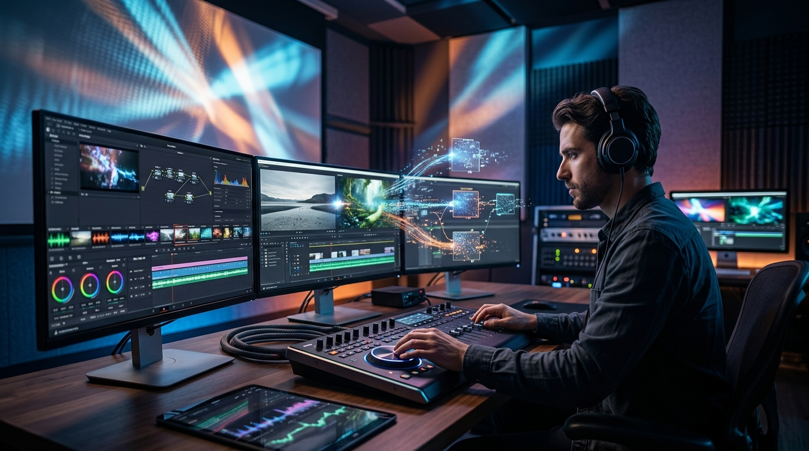

Krea AI Video FX 2026 업데이트를 통해 'Direct Motion Hub' 기능이 새롭게 도입되었습니다. 이제 Krea에서 만든 정지 이미지를 Runway Gen-4.5, Luma Ray 3, Kling 2.6 등 주요 영상 생성 엔진으로 곧바로 전송할 수 있습니다.

> 이를 통해 애니메이션을 제작할 수 있습니다.

[원문 보기](https://videoreddit.edu.vn/%F0%9F%8E%A8-krea-ai-video-fx-2026-the-real-time-creative-instrument-update/)

## 음악 생성

음악 생성 쪽은 이번 주에 유독 방향이 선명했습니다. 프롬프트 한 줄 받아 곡을 뽑는 데서 끝나는 게 아니라, 내 파일과 스타일을 바로 들고 들어오게 만드는 쪽으로 확실히 꺾였습니다.

### 1. All the latest in AI ‘music’ | The Verge

`2026-03-31 | 웹 검색 | The Verge | update`

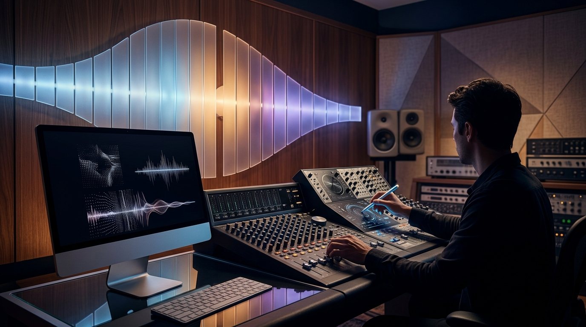

AI 음악 모델 Suno는 v5.5 업데이트를 통해 이전 버전들이 음질 개선에 집중했던 것과 달리 사용자에게 더 많은 제어 권한을 부여하는 데 초점을 맞췄습니다. 이는 인공지능이 생성한 결과물을 수동으로 다듬는 수준을 넘어, 사용자가 창작 과정에 더욱 깊이 개입하여 원하는 방향으로 음악을 만들어낼 수 있는 새로운 흐름을 의미합니다.

> 마치 악보대로 연주하던 AI가 이제 사용자의 지휘에 따라 곡의 뉘앙스를 조절하는 오케스트라가 된 셈입니다.

[원문 보기](https://www.theverge.com/ai-artificial-intelligence/903196/ai-music-suno-udio-art-lawsuit)

### 2. Suno 5.5 lets users sing their own AI-generated songs with a personalized voice feature

`2026-03-28 | 웹 검색 | The Decoder | update`

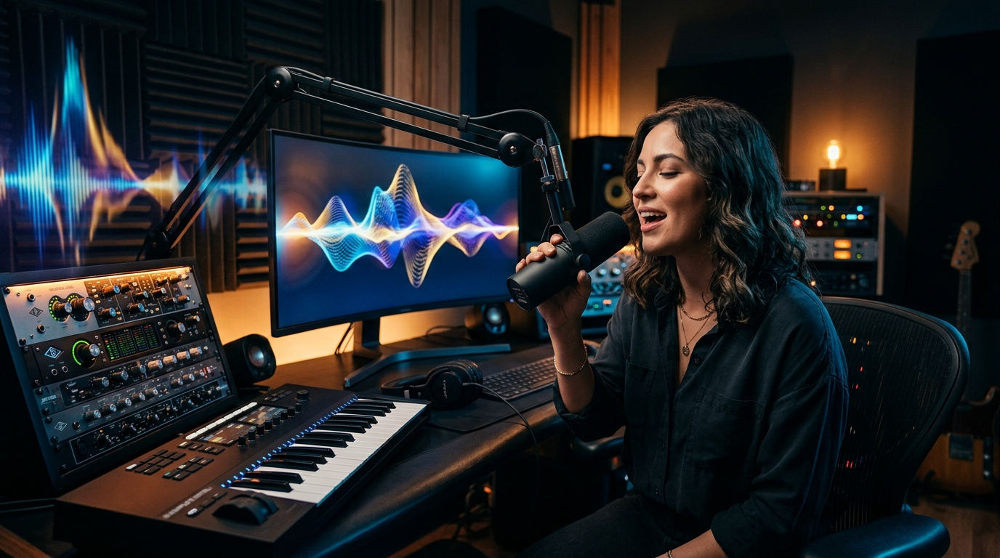

Suno v5.5 업데이트는 사용자가 자신의 목소리로 AI 생성곡을 부를 수 있도록 지원합니다. 또한, 개인 스타일을 학습하여 사용자의 취향에 맞춰 결과물을 자동 조정합니다.

> 이제 사용자는 AI 음악 감상을 넘어 자신의 목소리와 개성을 담아 직접 창작에 참여할 수 있습니다.

[원문 보기](https://the-decoder.com/suno-5-5-lets-users-sing-their-own-ai-generated-songs-with-a-personalized-voice-feature/)

### 추가로 본 이슈

- 음악 생성에서 손이 많이 가던 구간을 줄이는 기능을 내놨습니다 (The Verge)
- 음악 생성에서 손이 많이 가던 구간을 줄이는 기능을 내놨습니다 (u/RIPT1D3_Z)

## 3D

3D 쪽은 멋진 결과물보다 후속 수정과 파이프라인 연결이 더 중요해진 흐름입니다.

### 1. Tripo AI Launches Smart Mesh P1.0, Marking the Arrival of AI 3D 2.0 - San Francisco Today

`2026-04-02 | 웹 검색 | National Today | update`

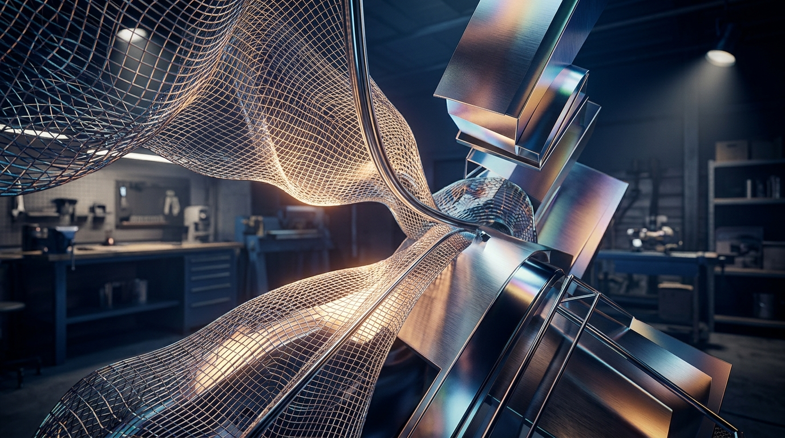

National Today 쪽에서 이번 주 흐름을 보여주는 공식 업데이트가 나왔습니다. 3D 쪽 변화는 샘플 한 장보다 모델 정리, 후속 수정, 파이프라인 연결 편의성으로 드러납니다.

> 멋진 렌더 한 장보다, 모델링 책상 위에 손이 덜 가는 공구를 올린 셈입니다.

[원문 보기](https://nationaltoday.com/us/ca/san-francisco/news/2026/04/01/tripo-ai-launches-smart-mesh-p1-0-marking-the-arrival-of-ai-3d-2-0/)

### 2. Tripo AI Launches Smart Mesh P1.0, Marking the Arrival of AI 3D 2.0 | Press Releases | wboc.com

`2026-04-02 | 웹 검색 | WBOC | update`

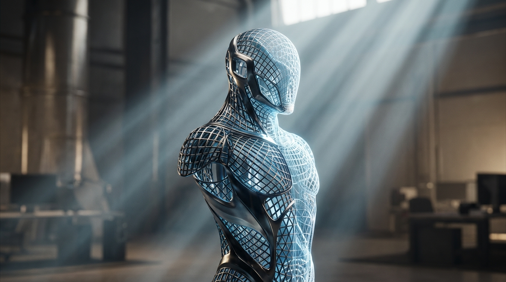

WBOC 쪽에서 이번 주 흐름을 보여주는 공식 업데이트가 나왔습니다. 3D 쪽 변화는 샘플 한 장보다 모델 정리, 후속 수정, 파이프라인 연결 편의성으로 드러납니다.

> 멋진 렌더 한 장보다, 모델링 책상 위에 손이 덜 가는 공구를 올린 셈입니다.

[원문 보기](https://www.wboc.com/online_features/press_releases/tripo-ai-launches-smart-mesh-p1-0-marking-the-arrival-of-ai-3d-2-0/article_0956b79c-9a43-518e-ab7a-5d5fd3a1e82f.html)

### 추가로 본 이슈

- 이번 주 흐름을 보여주는 공식 업데이트가 나왔습니다 (Prism News)
- 이번 주 흐름을 보여주는 공식 업데이트가 나왔습니다 (3D Printing Industry)
- 이번 주 흐름을 보여주는 공식 업데이트가 나왔습니다 (3D Printing Industry)

## 에이전트/자동화

에이전트/자동화는 데모보다 실제로 어디까지 맡길 수 있느냐가 핵심입니다.

### 1. GitHub - vercel-labs/agent-browser: Browser automation CLI for AI agents · GitHub

`2026-03-30 | 웹 검색 | GitHub | update`

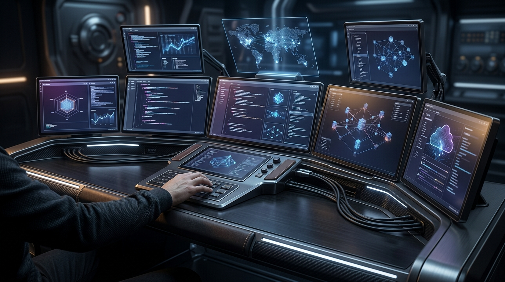

Vercel의 `agent-browser`는 AI 에이전트의 브라우저 자동화를 실행합니다. 이제 로컬 브라우저 대신 Browser Use 클라우드 세션에 연결하여 진행됩니다.

> 똑똑한 비서 한 명보다, 자주 하던 심부름에 전용 동선을 깔아 놓은 느낌입니다.

[원문 보기](https://github.com/vercel-labs/agent-browser)

### 2. How are you handling vendor patch management for AI agent frameworks like OpenClaw in enterprise environments?

`2026-04-01 | 커뮤니티 레이더 | u/npc_gooner | update`

사내 여러 팀이 워크플로우 자동화를 위해 OpenClaw를 시험적으로 도입하기 시작했습니다. 에이전트 영역은 데모보다 실제 워크플로에 몇 단계까지 맡길 수 있느냐가 승부처입니다.

> Ant AI Security Lab이 3일간 진행한 제3자 감사에서 33건의 취약점이 보고되었습니다.

[원문 보기](https://www.reddit.com/r/AskNetsec/comments/1s9e1kl/how_are_you_handling_vendor_patch_management_for/)

### 추가로 본 이슈

- 이번 주 흐름을 보여주는 공식 업데이트가 나왔습니다 (WordPress)
- 이번 주 흐름을 보여주는 공식 업데이트가 나왔습니다 (u/steadeepanda)
- 이번 주 흐름을 보여주는 공식 업데이트가 나왔습니다 (u/YUYbox)

## 지금 많이 보는 AI 유튜브

이번 주 이슈랑 같이 보면 맥락 잡기 좋은 영상 3개만 골랐습니다. 뉴스형 브리핑 위주로 넣었습니다.

### 1. AI News: Anthropic Leak is Bigger Than You Think

`2026-04-03 | YouTube | Matt Wolfe | 2.8만회`

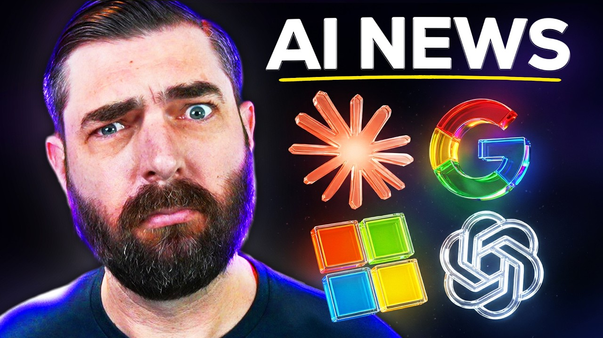

이번 주 웹진에서 다룬 Anthropic 흐름을 같이 훑기 좋은 영상입니다.

[원문 보기](https://www.youtube.com/watch?v=BZ1hs2ZcnJc)

### 2. AI News: Gemini Is SO Much Better Now (+ NotebookLM, Claude and Siri Updates)

`2026-03-28 | YouTube | Paul J Lipsky | 7.8만회`

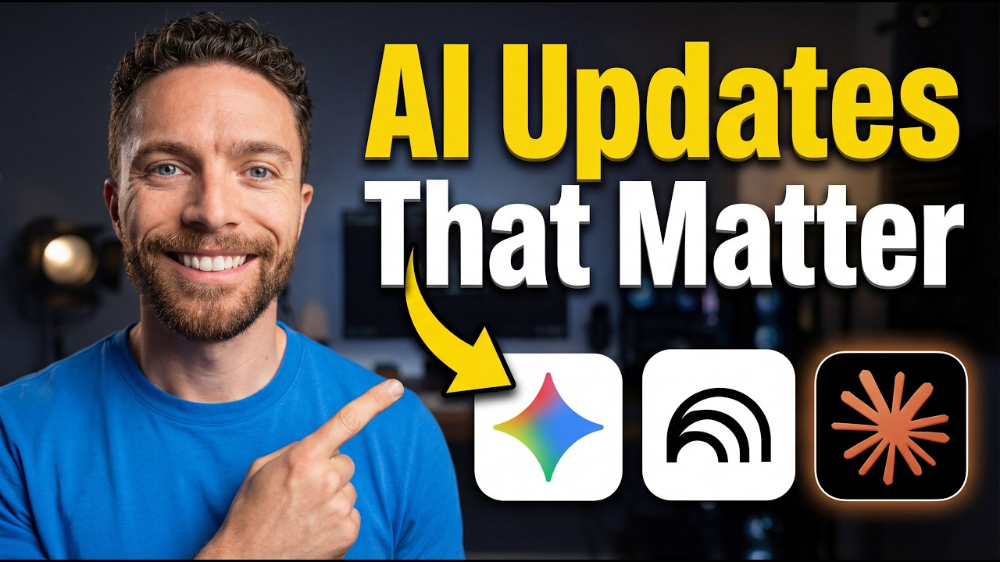

이번 주 웹진에서 다룬 Gemini 흐름을 같이 훑기 좋은 영상입니다.

[원문 보기](https://www.youtube.com/watch?v=jWNlxQQ_W_Q)

### 3. AI News: Anthropic Went Crazy This Week!

`2026-03-27 | YouTube | Matt Wolfe | 12.0만회`

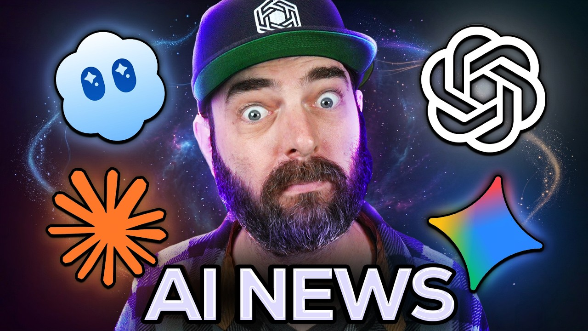

이번 주 웹진에서 다룬 Anthropic 흐름을 같이 훑기 좋은 영상입니다.

[원문 보기](https://www.youtube.com/watch?v=OYyS0Gu5xj8)
