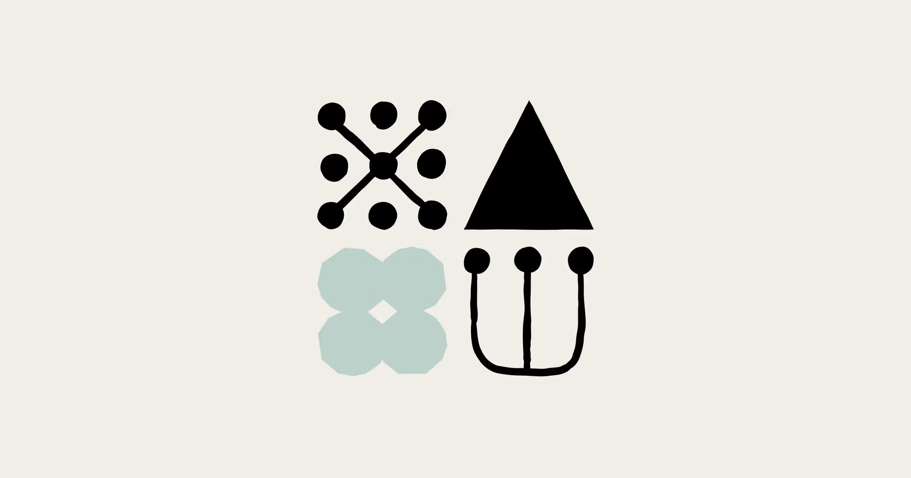
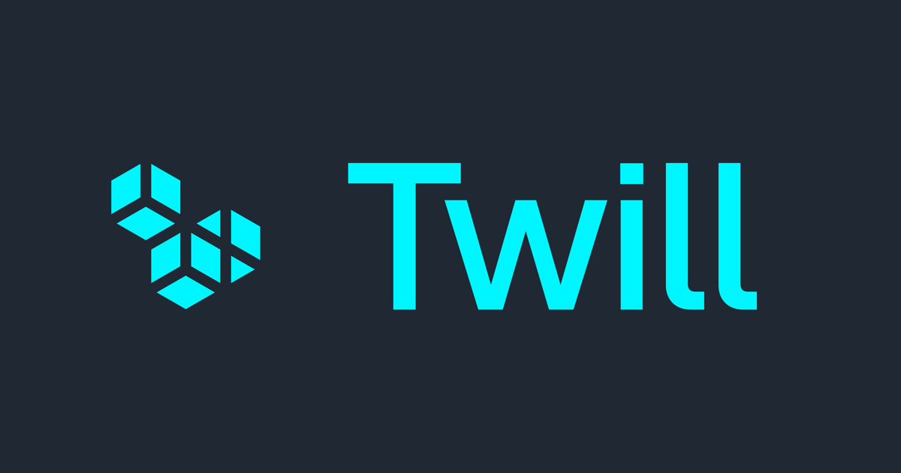
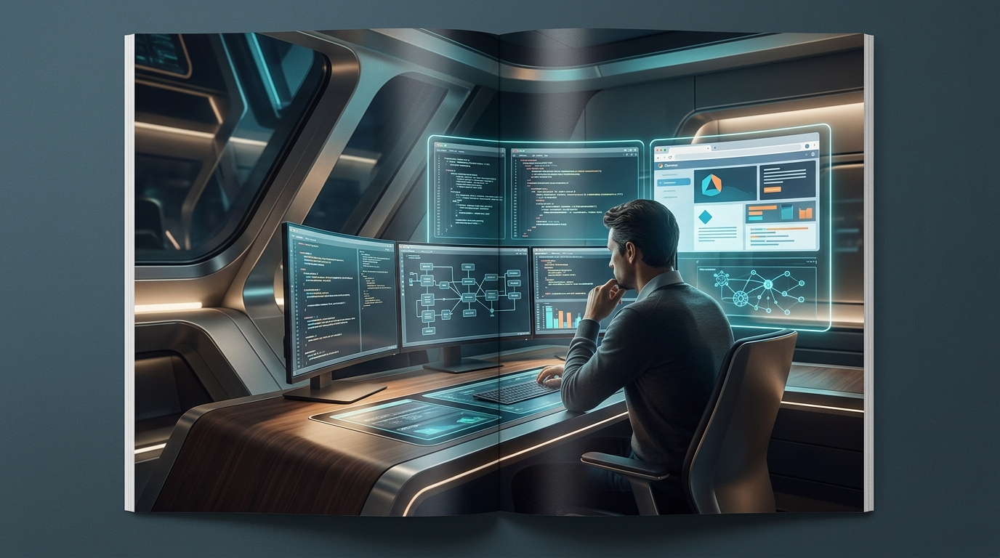
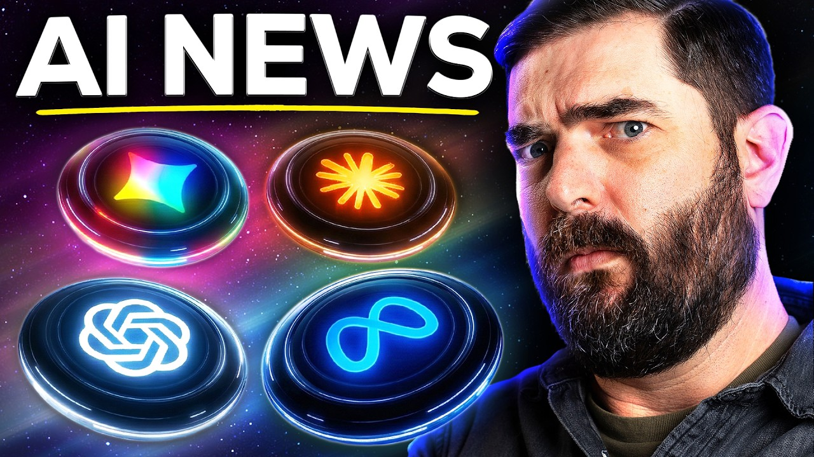

# 주간 AI 웹진 — 2026-04-11

> 이번 주 AI판, 속도전보다 워크플로 싸움이 더 뜨거웠습니다.

> 기간: 2026-04-04 ~ 2026-04-11
> 수집 건수: 76

## 이번 주 판세 요약

**이번 주는 새 모델이 튀어나온 것보다, 이미 있던 도구들이 어디까지 실무를 먹어치우는지가 더 또렷하게 보인 한 주였습니다.**

이번 주 공식 업데이트를 보면, 경쟁 포인트가 이제 단순 성능 자랑에서 작업 흐름 장악으로 넘어가고 있다는 게 보입니다.

### 세 줄 요약

- 이번 주 핵심은 신모델 공개보다 기존 워크플로를 갈아끼우는 변화였습니다.
- 음악·영상 생성 툴은 프롬프트 경쟁보다 내 소스와 자산을 바로 붙여 쓰는 쪽으로 움직였습니다.
- LLM 쪽은 성능 과시보다 도구 연결, 평가, 장기 실행 같은 실무 체력 강화가 더 선명했습니다.

## LLM

이번 주 LLM은 성능표보다 운영표가 더 중요해진 주간이었습니다.

### 1. Scaling Managed Agents: Decoupling the brain from the hands

`2026-04-11 | 공식 발표 | Anthropic | update`

Anthropic가 모델 자체보다 개발 워크플로 쪽에 더 가까운 공식 업데이트를 내놨습니다. 이쪽은 성능 숫자 자랑보다, 개발자가 도구를 어떻게 붙이고 일에 태우느냐가 더 중요해지는 흐름입니다.

> 엔진 출력표보다, 자주 타는 차에 자동변속기를 달아 놓은 쪽에 더 가깝습니다.

[원문 보기](https://www.anthropic.com/engineering/managed-agents)

### 2. Advancing Claude in healthcare and the life sciences

`2026-04-10 | 공식 발표 | Anthropic | update`

Anthropic은 과학자와 임상의를 위한 연구 파트너였던 Claude를 확장하여, 의료 서비스 제공자, 보험사, 헬스케어 기술 기업을 위한 'Claude for Healthcare'를 새롭게 선보였습니다. 이로써 AI가 생명 과학 연구를 넘어 실제 의료 현장의 진료, 보험 처리, 기술 개발 전반에 걸쳐 맞춤형 지원을 제공하며 산업 전반의 효율성을 크게 높일 전망입니다.

> 마치 만능 도구가 의료 현장에 특화된 정밀 부품을 장착한 것과 같습니다.

[원문 보기](https://www.anthropic.com/news/healthcare-life-sciences)

### 추가로 본 이슈

- 모델 자체보다 개발 워크플로 쪽에 더 가까운 공식 업데이트를 내놨습니다 (Anthropic)
- 모델 자체보다 개발 워크플로 쪽에 더 가까운 공식 업데이트를 내놨습니다 (Google)
- 모델 자체보다 개발 워크플로 쪽에 더 가까운 공식 업데이트를 내놨습니다 (Google)
- 모델 자체보다 개발 워크플로 쪽에 더 가까운 공식 업데이트를 내놨습니다 (Anthropic)
- 모델 자체보다 개발 워크플로 쪽에 더 가까운 공식 업데이트를 내놨습니다 (Google)
- 모델 자체보다 개발 워크플로 쪽에 더 가까운 공식 업데이트를 내놨습니다 (Google)
- 모델 자체보다 개발 워크플로 쪽에 더 가까운 공식 업데이트를 내놨습니다 (Google)
- 모델 자체보다 개발 워크플로 쪽에 더 가까운 공식 업데이트를 내놨습니다 (LLM Leaderboard)
- 모델 자체보다 개발 워크플로 쪽에 더 가까운 공식 업데이트를 내놨습니다 (surprisetalk)
- 모델 자체보다 개발 워크플로 쪽에 더 가까운 공식 업데이트를 내놨습니다 (StanAngeloff)
- 모델 자체보다 개발 워크플로 쪽에 더 가까운 공식 업데이트를 내놨습니다 (u/No-Manufacturer4818)
- 모델 자체보다 개발 워크플로 쪽에 더 가까운 공식 업데이트를 내놨습니다 (u/VangelisOnAUnicyle)
- 모델 자체보다 개발 워크플로 쪽에 더 가까운 공식 업데이트를 내놨습니다 (u/-_Heart)
- 모델 자체보다 개발 워크플로 쪽에 더 가까운 공식 업데이트를 내놨습니다 (u/DataGirlTraining)
- 모델 자체보다 개발 워크플로 쪽에 더 가까운 공식 업데이트를 내놨습니다 (u/i2wh)
- 모델 자체보다 개발 워크플로 쪽에 더 가까운 공식 업데이트를 내놨습니다 (u/InterstellarKinetics)
- 모델 자체보다 개발 워크플로 쪽에 더 가까운 공식 업데이트를 내놨습니다 (u/davidhorison)
- 모델 자체보다 개발 워크플로 쪽에 더 가까운 공식 업데이트를 내놨습니다 (u/enoumen)
- 모델 자체보다 개발 워크플로 쪽에 더 가까운 공식 업데이트를 내놨습니다 (u/ufo-uap)
- 모델 자체보다 개발 워크플로 쪽에 더 가까운 공식 업데이트를 내놨습니다 (u/EquipmentFun9258)
- 모델 자체보다 개발 워크플로 쪽에 더 가까운 공식 업데이트를 내놨습니다 (u/eCommerce-Guy-Jason)
- 모델 자체보다 개발 워크플로 쪽에 더 가까운 공식 업데이트를 내놨습니다 (u/i_serghei)
- 모델 자체보다 개발 워크플로 쪽에 더 가까운 공식 업데이트를 내놨습니다 (Yahoo!)
- 모델 자체보다 개발 워크플로 쪽에 더 가까운 공식 업데이트를 내놨습니다 (u/agentXchain_dev)
- 모델 자체보다 개발 워크플로 쪽에 더 가까운 공식 업데이트를 내놨습니다 (Logans_Run)
- 모델 자체보다 개발 워크플로 쪽에 더 가까운 공식 업데이트를 내놨습니다 (u/gossip-cat)
- 모델 자체보다 개발 워크플로 쪽에 더 가까운 공식 업데이트를 내놨습니다 (u/Veronildo)
- 모델 자체보다 개발 워크플로 쪽에 더 가까운 공식 업데이트를 내놨습니다 (u/lpdavis)
- 모델 자체보다 개발 워크플로 쪽에 더 가까운 공식 업데이트를 내놨습니다 (u/modassembly)
- 모델 자체보다 개발 워크플로 쪽에 더 가까운 공식 업데이트를 내놨습니다 (u/pigeon57434)
- 모델 자체보다 개발 워크플로 쪽에 더 가까운 공식 업데이트를 내놨습니다 (u/RammaStardock)
- 모델 자체보다 개발 워크플로 쪽에 더 가까운 공식 업데이트를 내놨습니다 (u/linah-nour)
- 모델 자체보다 개발 워크플로 쪽에 더 가까운 공식 업데이트를 내놨습니다 (u/cbcuiuc)
- 모델 자체보다 개발 워크플로 쪽에 더 가까운 공식 업데이트를 내놨습니다 (u/stanley-for-coffee)
- 모델 자체보다 개발 워크플로 쪽에 더 가까운 공식 업데이트를 내놨습니다 (u/Objective_Farm_1886)
- 모델 자체보다 개발 워크플로 쪽에 더 가까운 공식 업데이트를 내놨습니다 (u/phlx0)
- 모델 자체보다 개발 워크플로 쪽에 더 가까운 공식 업데이트를 내놨습니다 (u/ahmadreza777)
- 모델 자체보다 개발 워크플로 쪽에 더 가까운 공식 업데이트를 내놨습니다 (u/Planhub-ca)
- 모델 자체보다 개발 워크플로 쪽에 더 가까운 공식 업데이트를 내놨습니다 (u/QuantumQuicksilver)
- 모델 자체보다 개발 워크플로 쪽에 더 가까운 공식 업데이트를 내놨습니다 (u/softtechhubus)
- 모델 자체보다 개발 워크플로 쪽에 더 가까운 공식 업데이트를 내놨습니다 (u/pc_gamerguy)
- 모델 자체보다 개발 워크플로 쪽에 더 가까운 공식 업데이트를 내놨습니다 (u/collo_turnitin)
- 모델 자체보다 개발 워크플로 쪽에 더 가까운 공식 업데이트를 내놨습니다 (u/Nalix01)
- 모델 자체보다 개발 워크플로 쪽에 더 가까운 공식 업데이트를 내놨습니다 (u/empirical_)
- 모델 자체보다 개발 워크플로 쪽에 더 가까운 공식 업데이트를 내놨습니다 (u/Hot-Split-613)
- 모델 자체보다 개발 워크플로 쪽에 더 가까운 공식 업데이트를 내놨습니다 (u/self_made_human)
- 모델 자체보다 개발 워크플로 쪽에 더 가까운 공식 업데이트를 내놨습니다 (u/0xnothoney)
- 모델 자체보다 개발 워크플로 쪽에 더 가까운 공식 업데이트를 내놨습니다 (u/life_sculptor)

## 이미지 생성

이미지 생성은 화질 과시보다 테스트를 얼마나 많이, 싸게 돌릴 수 있느냐가 더 큰 경쟁 포인트로 보였습니다.

### 1. MidJourney V8 for Designers: What's Real, What's Hype (2026)

`2026-04-08 | 웹 검색 | House of gAi | update`

MidJourney V8은 기존 TPU 아키텍처를 PyTorch 기반의 새로운 GPU-native 코드베이스로 완전히 재구축했습니다. 이는 단순히 점진적 개선을 넘어 이미지 생성 AI의 근본적인 처리 능력과 확장성에 새로운 흐름을 만들 것입니다.

> 낡은 건물을 허물고 최신 공법으로 완전히 새로 지은 것과 같습니다.

[원문 보기](https://www.houseofgai.com/blog/midjourney-v8-big-rebuild-claims-was-i-wowed)

### 2. Midjourney Review: Features, Pricing, Pros & Cons | AI Tools

`2026-04-04 | 웹 검색 | FirstSales | update`

Midjourney는 매주 사소한 개선과 버그 수정을, 분기마다 주요 기능을 정기적으로 배포합니다. 사용자들은 공개 변경 로그를 통해 이러한 변화를 추적할 수 있습니다.

> 한 번 잘 나오는 필터보다, 작업실 조명이 통째로 바뀐 느낌에 가깝습니다.

[원문 보기](https://firstsales.io/brand-review/midjourney/)

### 추가로 본 이슈

- 차세대 이미지 모델 `V8 Alpha` 테스트를 본격적으로 열었습니다 (AiExotic)

## 음악 생성

음악 생성 쪽은 이번 주에 유독 방향이 선명했습니다. 프롬프트 한 줄 받아 곡을 뽑는 데서 끝나는 게 아니라, 내 파일과 스타일을 바로 들고 들어오게 만드는 쪽으로 확실히 꺾였습니다.

### 1. ElevenLabs Just Entered the AI Music War — And Suno and Udio Should Be Worried | VoteMyAI

`2026-04-04 | 웹 검색 | VoteMyAI | update`

AI 음악 생성 플랫폼 Suno는 최근 v5.5 업데이트를 통해 Voices, Custom Models, My Taste 기능을 선보였습니다. 이를 통해 사용자 경험을 한층 개인화했습니다.

> 멜로디 하나 얻는 수준이 아니라, 세션 파일에 자주 쓰는 악기 체인을 저장한 느낌입니다.

[원문 보기](https://www.votemyai.com/blog/elevenlabs-elevenmusic-app-suno-udio-competitor.html)

### 2. Suno V6 Latest Update 2026: Confirmed News & Rumors | MusicMaker.IM

`2026-04-04 | 웹 검색 | Musicmaker | update`

Musicmaker가 음악 생성에서 손이 많이 가던 구간을 줄이는 기능을 내놨습니다. 음악 생성은 한 곡 뽑기보다 소스 입력, 스타일 유지, 후반 작업 연결성이 시간을 아껴줍니다.

> 멜로디 하나 얻는 수준이 아니라, 세션 파일에 자주 쓰는 악기 체인을 저장한 느낌입니다.

[원문 보기](https://musicmaker.im/blog/detail/Suno-V6-Latest-Update-What-s-Confirmed-What-s-Rumored-2026-81c99537ca0d/)

### 추가로 본 이슈

- 음악 생성에서 손이 많이 가던 구간을 줄이는 기능을 내놨습니다 (u/RIPT1D3_Z)

## 편집/제작

편집/제작 쪽은 새 버튼 하나보다 실제 반복 공정을 얼마나 덜어주느냐가 포인트입니다.

### 1. New image editing features in Adobe Firefly get you from ‘almost there’ to ‘exactly right’

`2026-04-10 | 웹 검색 | Adobe | update`

Adobe 쪽에서 이번 주 흐름을 보여주는 공식 업데이트가 나왔습니다. 편집 툴은 성능 과시보다 클릭 수를 줄이고 반복 공정을 덜어내는 쪽에서 체감 차이가 납니다.

> 새 버튼 하나보다 반복 클릭을 매크로로 묶어버린 쪽에 더 가깝습니다.

[원문 보기](https://blog.adobe.com/en/publish/2026/04/09/new-image-editing-features-adobe-firefly-get-you-from-almost-there-to-exactly-right)

### 2. Launch HN: Twill.ai (YC S25) – Delegate to cloud agents, get back PRs

`2026-04-11 | 커뮤니티 레이더 | danoandco | update`

Twill.ai가 새로운 서비스를 선보입니다. 개발자들은 코딩 작업을 클라우드 에이전트에게 온전히 위임할 수 있습니다.

> 에이전트는 코드를 작성, 테스트, 배포하고 완성형 풀 리퀘스트를 제공합니다.

[원문 보기](https://twill.ai)

## 3D

3D 쪽은 멋진 결과물보다 후속 수정과 파이프라인 연결이 더 중요해진 흐름입니다.

### 1. Introducing Tripo H3.1: High Detail Model for Production-Ready Assets

`2026-04-09 | 공식 발표 | Tripo | update`

Tripo는 고품질 3D 에셋 제작 시간을 대폭 줄여줄 고디테일 모델 H3.1을 공개했습니다. 이 모델은 게임이나 마케팅 비주얼에 필요한 정교한 결과물을 만들어낼 수 있습니다.

> 시각적 완성도 저하 없이 훨씬 빠르게.

[원문 보기](https://www.tripo3d.ai/blog/introducing-hd-model-v3-1)

### 2. How to Turn 2D Drawing (or Sketch) into 3D Model [5 Ways] - Blog - Meshy

`2026-04-08 | 공식 발표 | Meshy | update`

![How to Turn 2D Drawing (or Sketch) into 3D Model [5 Ways] - Blog - Meshy](images/2026-04-11_how-to-turn-2d-drawing-or-sketch-into-3d-model-5-ways-blog-meshy_6ac17b2a2078.webp)

Meshy 쪽에서 이번 주 흐름을 보여주는 공식 업데이트가 나왔습니다. 3D 쪽 변화는 샘플 한 장보다 모델 정리, 후속 수정, 파이프라인 연결 편의성으로 드러납니다.

> 멋진 렌더 한 장보다, 모델링 책상 위에 손이 덜 가는 공구를 올린 셈입니다.

[원문 보기](https://www.meshy.ai/blog/sketch-to-3d)

### 추가로 본 이슈

- 이번 주 흐름을 보여주는 공식 업데이트가 나왔습니다 (Meshy)
- 이번 주 흐름을 보여주는 공식 업데이트가 나왔습니다 (Trustpilot)
- 이번 주 흐름을 보여주는 공식 업데이트가 나왔습니다 (Neural4D)

## 에이전트/자동화

에이전트/자동화는 데모보다 실제로 어디까지 맡길 수 있느냐가 핵심입니다.

### 1. GitHub - ChromeDevTools/chrome-devtools-mcp: Chrome DevTools for coding agents · GitHub

`2026-04-09 | 웹 검색 | GitHub | update`

Google은 `Chrome DevTools MCP`의 사용 통계 수집을 `Chrome` 브라우저와 독립적으로 관리합니다. 이 도구는 npm 레지스트리에서 최신 버전 업데이트를 주기적으로 확인하여 사용자에게 알립니다.

> 똑똑한 비서 한 명보다, 자주 하던 심부름에 전용 동선을 깔아 놓은 느낌입니다.

[원문 보기](https://github.com/ChromeDevTools/chrome-devtools-mcp/)

### 2. Adobe Firefly Updates Provide Insight into Adobe's AI-Native Platform

`2026-04-06 | 웹 검색 | Forbes Australia | update`

어도비는 파이어플라이 최신 플랫폼 업데이트로 자체 AI 도구를 업계 선두 주자로 확립하고 있습니다. 이는 AI 네이티브 플랫폼으로 전환하려는 움직임의 일환입니다.

> 사용자 숙련도를 높이기 위한 프롬프트 라이브러리와 교육 자료도 적극적으로 제공하고 있습니다.

[원문 보기](https://www.forbes.com.au/brand-voice/uncategorized/adobe-firefly-and-the-ai-creative-shift/)

### 추가로 본 이슈

- 이번 주 흐름을 보여주는 공식 업데이트가 나왔습니다 (GitHub)
- 이번 주 흐름을 보여주는 공식 업데이트가 나왔습니다 (u/ugocat)
- 이번 주 흐름을 보여주는 공식 업데이트가 나왔습니다 (u/JerryH_)
- 이번 주 흐름을 보여주는 공식 업데이트가 나왔습니다 (u/loserdroid)
- 이번 주 흐름을 보여주는 공식 업데이트가 나왔습니다 (u/empirical_)
- 이번 주 흐름을 보여주는 공식 업데이트가 나왔습니다 (u/Acceptable_Debate393)
- 이번 주 흐름을 보여주는 공식 업데이트가 나왔습니다 (u/spupuz)
- 이번 주 흐름을 보여주는 공식 업데이트가 나왔습니다 (u/Most-Agent-7566)
- 이번 주 흐름을 보여주는 공식 업데이트가 나왔습니다 (u/Most-Agent-7566)
- 이번 주 흐름을 보여주는 공식 업데이트가 나왔습니다 (u/Most-Agent-7566)

## 지금 많이 보는 AI 유튜브

이번 주 이슈랑 같이 보면 맥락 잡기 좋은 영상 3개만 골랐습니다. 뉴스형 브리핑 위주로 넣었습니다.

### 1. AI News: The Scariest AI Model Ever!

`2026-04-10 | YouTube | Matt Wolfe | 3.4만회`

이번 주 AI 업데이트를 한 번에 훑기 좋은 브리핑형 영상입니다.

[원문 보기](https://www.youtube.com/watch?v=SguncMvE77I)

### 2. AI News: Claude Leaks, Free Google AI Updates, + ChatGPT CarPlay

`2026-04-04 | YouTube | Paul J Lipsky | 2.7만회`

이번 주 웹진에서 다룬 Claude 흐름을 같이 훑기 좋은 영상입니다.

[원문 보기](https://www.youtube.com/watch?v=Y9BOY4k_zb8)

### 3. AI News: Anthropic Leak Shows Us The Future of AI

`2026-04-03 | YouTube | Matt Wolfe | 9.9만회`

이번 주 웹진에서 다룬 Anthropic 흐름을 같이 훑기 좋은 영상입니다.

[원문 보기](https://www.youtube.com/watch?v=BZ1hs2ZcnJc)
