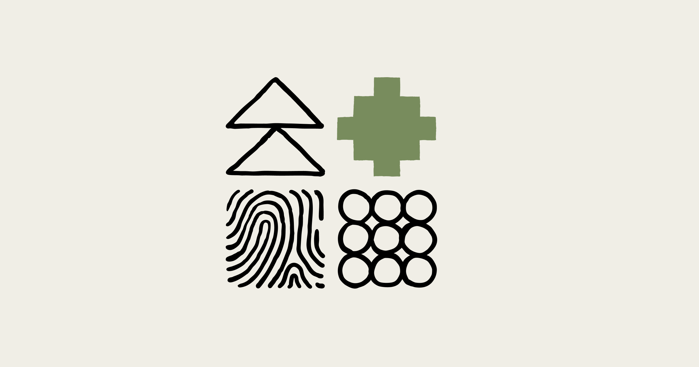
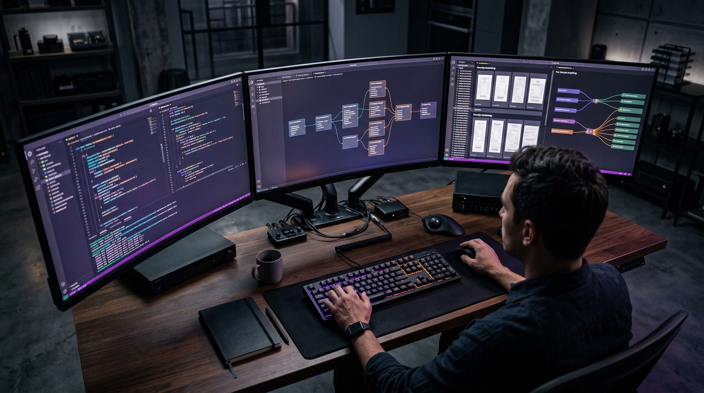
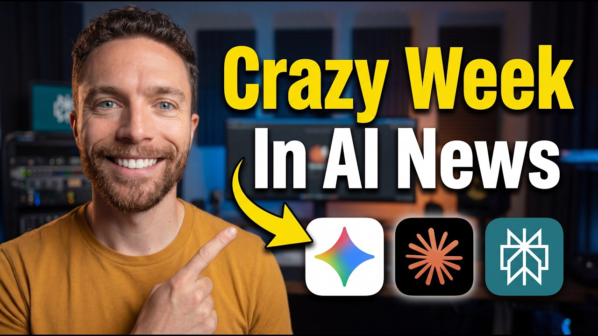
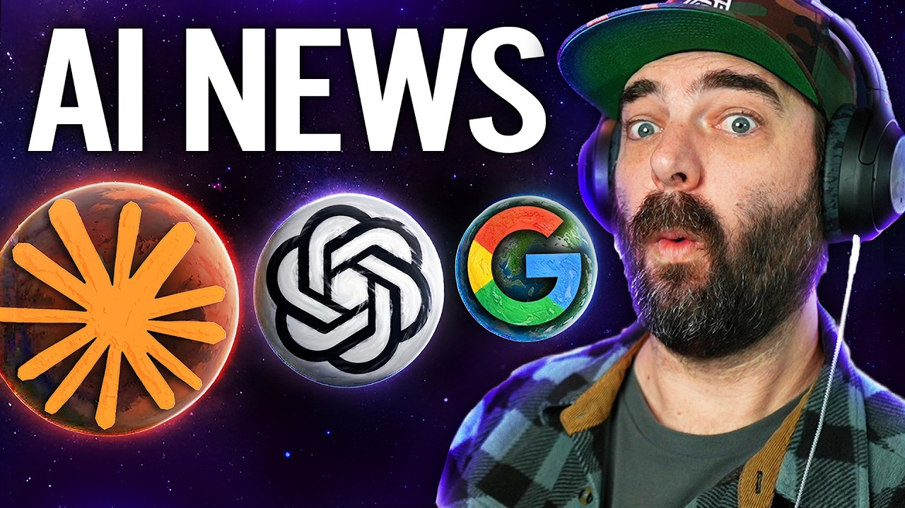

# 주간 AI 웹진 — 2026-04-25

> 이번 주 AI판, 속도전보다 워크플로 싸움이 더 뜨거웠습니다.

> 기간: 2026-04-18 ~ 2026-04-25
> 수집 건수: 65

## 이번 주 판세 요약

**이번 주는 새 모델이 튀어나온 것보다, 이미 있던 도구들이 어디까지 실무를 먹어치우는지가 더 또렷하게 보인 한 주였습니다.**

LLM 진영은 성능 숫자보다 도구 연결, 평가, 장기 실행 같은 실무 레이어를 두껍게 만드는 쪽으로 움직였습니다.

### 세 줄 요약

- 이번 주 핵심은 신모델 공개보다 기존 워크플로를 갈아끼우는 변화였습니다.
- 음악·영상 생성 툴은 프롬프트 경쟁보다 내 소스와 자산을 바로 붙여 쓰는 쪽으로 움직였습니다.
- LLM 쪽은 성능 과시보다 도구 연결, 평가, 장기 실행 같은 실무 체력 강화가 더 선명했습니다.

## LLM

이번 주 LLM은 성능표보다 운영표가 더 중요해진 주간이었습니다.

### 1. Quantifying infrastructure noise in agentic coding evals

`2026-04-24 | 공식 발표 | Anthropic | update`

Anthropic가 모델 자체보다 개발 워크플로 쪽에 더 가까운 공식 업데이트를 내놨습니다. 이건 데모 성능보다 개발 공정, 평가, 장기 실행 같은 진짜 실무 레이어를 두껍게 만드는 변화입니다.

> 새 데모 영상 하나보다, 백오피스 배선 공사를 다시 한 느낌입니다.

[원문 보기](https://www.anthropic.com/engineering/infrastructure-noise)

### 2. An update on recent Claude Code quality reports

`2026-04-24 | 공식 발표 | Anthropic | update`

지난 한 달간 사용자들의 클로드 응답 품질 저하 보고가 있었으며, 앤트로픽은 이를 클로드 코드, 클로드 에이전트 SDK, 클로드 코워크에 영향을 미친 세 가지 변경 사항 때문으로 파악하여 4월 20일부로 모두 해결했습니다. AI 모델의 성능은 한 번 구축되면 끝이 아니라 지속적인 관리와 업데이트가 필요하며, 이러한 해결 과정은 안정적인 AI 서비스 운영을 위한 필수적인 노력임을 보여줍니다.

> 마치 정밀한 기계가 주기적인 점검과 미세 조정을 거쳐야 최고의 성능을 유지하는 것과 같습니다.

[원문 보기](https://www.anthropic.com/engineering/april-23-postmortem)

### 추가로 본 이슈

- 모델 자체보다 개발 워크플로 쪽에 더 가까운 공식 업데이트를 내놨습니다 (Anthropic)
- 모델 자체보다 개발 워크플로 쪽에 더 가까운 공식 업데이트를 내놨습니다 (Google)
- 모델 자체보다 개발 워크플로 쪽에 더 가까운 공식 업데이트를 내놨습니다 (Google)
- 모델 자체보다 개발 워크플로 쪽에 더 가까운 공식 업데이트를 내놨습니다 (Anthropic)
- 모델 자체보다 개발 워크플로 쪽에 더 가까운 공식 업데이트를 내놨습니다 (Google)
- 이번 달 `Gemini` 앱에서 체감되는 신기능 묶음을 한 번에 정리했습니다 (Google)
- 모델 자체보다 개발 워크플로 쪽에 더 가까운 공식 업데이트를 내놨습니다 (Google)
- 모델 자체보다 개발 워크플로 쪽에 더 가까운 공식 업데이트를 내놨습니다 (Anthropic)
- 모델 자체보다 개발 워크플로 쪽에 더 가까운 공식 업데이트를 내놨습니다 (Google)
- 모델 자체보다 개발 워크플로 쪽에 더 가까운 공식 업데이트를 내놨습니다 (OpenAI Help Center)
- 모델 자체보다 개발 워크플로 쪽에 더 가까운 공식 업데이트를 내놨습니다 (arabicalories)
- OpenAI가 새로운 ChatGPT AI 모델인 GPT-5.5를 공식 출시했습니다 - Cryptopolitan (Cryptopolitan)
- 클로드 Claude Opus 4.7 업데이트 후기 - 브런치 (브런치)
- Gemini 업데이트를 사용하면 Google 포토 라이브러리에서 직접 맞춤 이미지를 만들 수 있습니다. - Mix Vale (Mix Vale)
- Claude Live Artfect 실제 사용 예시 - 브런치 (브런치)
- 앤스로픽을 신뢰할 수 있는가? - 브런치 (브런치)
- 모델 자체보다 개발 워크플로 쪽에 더 가까운 공식 업데이트를 내놨습니다 (u/triplebits)
- 모델 자체보다 개발 워크플로 쪽에 더 가까운 공식 업데이트를 내놨습니다 (u/TrudosKudos27)
- 모델 자체보다 개발 워크플로 쪽에 더 가까운 공식 업데이트를 내놨습니다 (u/the_king_of_goats)
- 모델 자체보다 개발 워크플로 쪽에 더 가까운 공식 업데이트를 내놨습니다 (u/the_king_of_goats)
- 모델 자체보다 개발 워크플로 쪽에 더 가까운 공식 업데이트를 내놨습니다 (u/hasamba)
- 모델 자체보다 개발 워크플로 쪽에 더 가까운 공식 업데이트를 내놨습니다 (u/nerdswithattitude)
- 모델 자체보다 개발 워크플로 쪽에 더 가까운 공식 업데이트를 내놨습니다 (u/jetstros)
- 모델 자체보다 개발 워크플로 쪽에 더 가까운 공식 업데이트를 내놨습니다 (u/ribspls)
- 모델 자체보다 개발 워크플로 쪽에 더 가까운 공식 업데이트를 내놨습니다 (u/RamsinJacobRealty)
- 모델 자체보다 개발 워크플로 쪽에 더 가까운 공식 업데이트를 내놨습니다 (u/kaysersoze76)
- 모델 자체보다 개발 워크플로 쪽에 더 가까운 공식 업데이트를 내놨습니다 (u/Rude-Mellon)
- 모델 자체보다 개발 워크플로 쪽에 더 가까운 공식 업데이트를 내놨습니다 (u/OpenClawInstall)
- 모델 자체보다 개발 워크플로 쪽에 더 가까운 공식 업데이트를 내놨습니다 (u/LambSaucee)
- 모델 자체보다 개발 워크플로 쪽에 더 가까운 공식 업데이트를 내놨습니다 (u/Artistic_Scallion152)
- 모델 자체보다 개발 워크플로 쪽에 더 가까운 공식 업데이트를 내놨습니다 (u/Dramatic_Squash_3502)
- 모델 자체보다 개발 워크플로 쪽에 더 가까운 공식 업데이트를 내놨습니다 (u/ZookeepergameFit4082)
- 모델 자체보다 개발 워크플로 쪽에 더 가까운 공식 업데이트를 내놨습니다 (u/Truthmqne)
- 모델 자체보다 개발 워크플로 쪽에 더 가까운 공식 업데이트를 내놨습니다 (u/IndependentBig5316)
- 모델 자체보다 개발 워크플로 쪽에 더 가까운 공식 업데이트를 내놨습니다 (u/Nalix01)
- 모델 자체보다 개발 워크플로 쪽에 더 가까운 공식 업데이트를 내놨습니다 (u/dnationpt)
- 모델 자체보다 개발 워크플로 쪽에 더 가까운 공식 업데이트를 내놨습니다 (u/Cautious-Piece1038)
- 모델 자체보다 개발 워크플로 쪽에 더 가까운 공식 업데이트를 내놨습니다 (u/Strict_Republic_1542)
- 모델 자체보다 개발 워크플로 쪽에 더 가까운 공식 업데이트를 내놨습니다 (u/throwaway4whattt)
- 모델 자체보다 개발 워크플로 쪽에 더 가까운 공식 업데이트를 내놨습니다 (u/ThisGonBHard)
- 모델 자체보다 개발 워크플로 쪽에 더 가까운 공식 업데이트를 내놨습니다 (u/thewaywardson)
- 모델 자체보다 개발 워크플로 쪽에 더 가까운 공식 업데이트를 내놨습니다 (u/DigiHold)

## 이미지 생성

이미지 생성은 화질 과시보다 테스트를 얼마나 많이, 싸게 돌릴 수 있느냐가 더 큰 경쟁 포인트로 보였습니다.

### 1. Current Firefly promotions

`2026-04-22 | 웹 검색 | Adobe | update`

Adobe가 Firefly 프로모션의 최신 혜택, 업데이트, 추가 세부 정보를 확인할 수 있도록 안내했습니다. 이미지 생성 분야에서 Adobe Firefly가 제공하는 지속적인 혜택과 업데이트는 기술 발전과 사용자 경험 확장의 중요성을 강조합니다.

> 한 번 잘 나오는 필터보다, 작업실 조명이 통째로 바뀐 느낌에 가깝습니다.

[원문 보기](https://helpx.adobe.com/firefly/web/get-started/learn-the-basics/current-firefly-promotions.html)

### 2. What’s New in Midjourney 8.1 Update? Key Features Revealed - Midjourney V6

`2026-04-21 | 웹 검색 | Midjourney V6 | update`

Midjourney가 새로운 버전 8.1을 알파 웹사이트(alpha.midjourney.com)에 선보였으며, 이 업데이트로 이미지들이 한층 더 아름답게 표현됩니다. 이번 개선으로 사용자들은 별도의 보정 없이도 훨씬 더 세련되고 만족스러운 결과물을 바로 얻을 수 있게 되었으니, 창작 과정의 효율성이 크게 향상될 전망입니다.

> 마치 흐릿했던 사진에 선명도 필터를 입힌 것과 같습니다.

[원문 보기](https://midjourneyv6.org/midjourney-8-1-update-features/)

### 추가로 본 이슈

- 이번 주 이미지 생성 흐름을 바꾸는 업데이트를 꺼냈습니다 (Fstoppers)
- 이번 주 이미지 생성 흐름을 바꾸는 업데이트를 꺼냈습니다 (Deccan Herald)
- 이번 주 이미지 생성 흐름을 바꾸는 업데이트를 꺼냈습니다 (Run The Prompts)
- 이번 주 이미지 생성 흐름을 바꾸는 업데이트를 꺼냈습니다 (Medium)

## 3D

3D 쪽은 멋진 결과물보다 후속 수정과 파이프라인 연결이 더 중요해진 흐름입니다.

### 1. Best 3D Modeling Software for 3D Printing [Free & Paid] - Blog - Meshy

`2026-04-23 | 공식 발표 | Meshy | update`

![Best 3D Modeling Software for 3D Printing [Free & Paid] - Blog - Meshy](images/2026-04-25_best-3d-modeling-software-for-3d-printing-free-paid-blog-meshy_3c9e61f4b1e7.webp)

AI 기반 플랫폼 Meshy는 3D 모델 제작 및 반복 작업을 몇 시간에서 몇 분으로 단축시켰습니다. 이러한 변화는 아이디어를 출력 가능한 모델로 빠르게 전환하며, 3D 프린팅의 전반적인 작업 흐름을 혁신적으로 바꿉니다.

> 상상 속 형태가 손안의 물건으로 즉시 피어나는 순간이 찾아왔다.

[원문 보기](https://www.meshy.ai/blog/3d-modeling-software-for-3d-printing)

### 2. How to Make 3D Printer Models or Files Easily? [Step by Step] - Blog - Meshy

`2026-04-23 | 공식 발표 | Meshy | update`

![How to Make 3D Printer Models or Files Easily? [Step by Step] - Blog - Meshy](images/2026-04-25_how-to-make-3d-printer-models-or-files-easily-step-by-step-blog-meshy_4d4153b756c8.webp)

Meshy는 블로그를 통해 AI 지원 디자인 도구를 활용하여 3D 프린팅 모델을 쉽게 만드는 단계별 가이드를 공개했습니다. 이 가이드는 디자인부터 기하학적 형태를 다듬는 과정을 포함합니다.

> STL 또는 3MF 파일로 내보내 슬라이서에서 준비하는 전 과정을 안내합니다.

[원문 보기](https://www.meshy.ai/blog/how-to-make-3d-models-for-printing)

### 추가로 본 이슈

- 이번 주 흐름을 보여주는 공식 업데이트가 나왔습니다 (Meshy)
- 이번 주 흐름을 보여주는 공식 업데이트가 나왔습니다 (Meshy)
- 이번 주 흐름을 보여주는 공식 업데이트가 나왔습니다 (Meshy)
- 이번 주 흐름을 보여주는 공식 업데이트가 나왔습니다 (Meshy)
- 이번 주 흐름을 보여주는 공식 업데이트가 나왔습니다 (Meshy)
- 이번 주 흐름을 보여주는 공식 업데이트가 나왔습니다 (Tracxn)

## 에이전트/자동화

에이전트/자동화는 데모보다 실제로 어디까지 맡길 수 있느냐가 핵심입니다.

### 1. MCP (Model Context Protocol) is quietly becoming the most important automation standard. Here’s why it matters.

`2026-04-24 | 커뮤니티 레이더 | u/SuccessfulRepublic87 | update`

현재 Claude, ChatGPT 같은 AI 도구들은 CRM이나 프로젝트 관리 시스템 등 기업의 비즈니스 시스템과 단절되어 있습니다. MCP(Model Context Protocol)는 AI 제안을 수동으로 복사해 붙여넣어야 하는 비효율적인 상황을 해결합니다.

> 똑똑한 비서 한 명보다, 자주 하던 심부름에 전용 동선을 깔아 놓은 느낌입니다.

[원문 보기](https://www.reddit.com/r/MarketingAutomation/comments/1stw8mb/mcp_model_context_protocol_is_quietly_becoming/)

### 2. Built a fully automated tax system with Claude; curious about real costs + ROI

`2026-04-20 | 커뮤니티 레이더 | u/PopPsychological1218 | update`

u/PopPsychological1218 쪽에서 이번 주 흐름을 보여주는 공식 업데이트가 나왔습니다. 에이전트 영역은 데모보다 실제 워크플로에 몇 단계까지 맡길 수 있느냐가 승부처입니다.

> 똑똑한 비서 한 명보다, 자주 하던 심부름에 전용 동선을 깔아 놓은 느낌입니다.

[원문 보기](https://www.reddit.com/r/AIcosts/comments/1sq4ejz/built_a_fully_automated_tax_system_with_claude/)

### 추가로 본 이슈

- 이번 주 흐름을 보여주는 공식 업데이트가 나왔습니다 (u/elogic_commerce)
- 이번 주 흐름을 보여주는 공식 업데이트가 나왔습니다 (u/Due-Scholar8591)
- 이번 주 흐름을 보여주는 공식 업데이트가 나왔습니다 (u/danielbilekq0)
- 이번 주 흐름을 보여주는 공식 업데이트가 나왔습니다 (u/Song-Historical)

## 지금 많이 보는 AI 유튜브

이번 주 이슈랑 같이 보면 맥락 잡기 좋은 영상 3개만 골랐습니다. 뉴스형 브리핑 위주로 넣었습니다.

### 1. AI News: The Biggest Leap We've Seen This Year!

`2026-04-24 | YouTube | Matt Wolfe | 2.9만회`

이번 주 AI 업데이트를 한 번에 훑기 좋은 브리핑형 영상입니다.

[원문 보기](https://www.youtube.com/watch?v=jsP-eRriC0k)

### 2. So Much AI News: Claude Design, Opus 4.7, Perplexity Personal Computer, and NotebookLM Updates!

`2026-04-18 | YouTube | Paul J Lipsky | 3.6만회`

이번 주 웹진에서 다룬 Claude 흐름을 같이 훑기 좋은 영상입니다.

[원문 보기](https://www.youtube.com/watch?v=RCVgaIWoogw)

### 3. AI News: Huge Updates From Anthropic, OpenAI and Google

`2026-04-17 | YouTube | Matt Wolfe | 11.7만회`

이번 주 웹진에서 다룬 Anthropic 흐름을 같이 훑기 좋은 영상입니다.

[원문 보기](https://www.youtube.com/watch?v=bIrzOQtnp8w)
