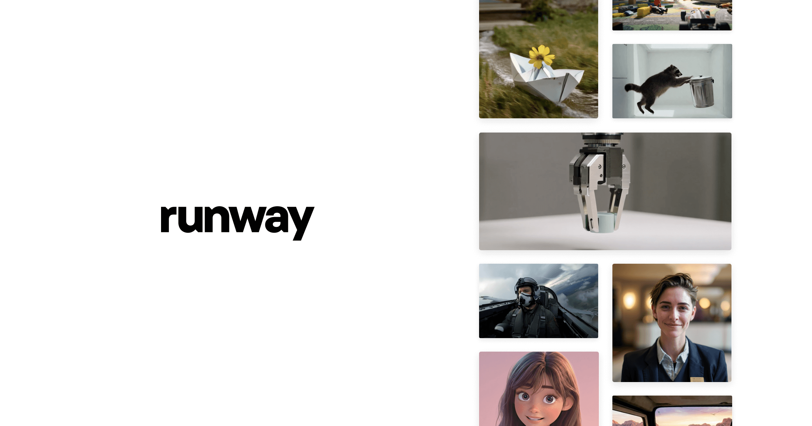
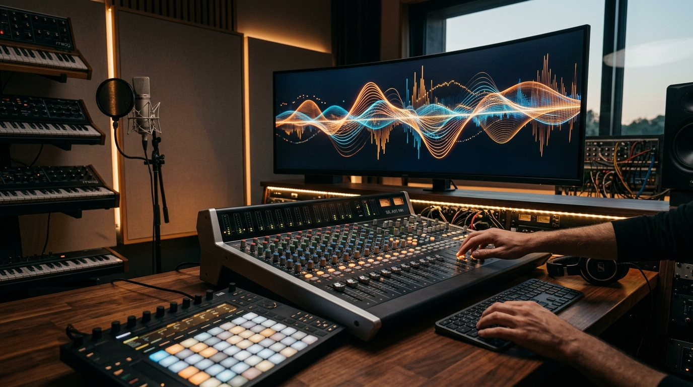
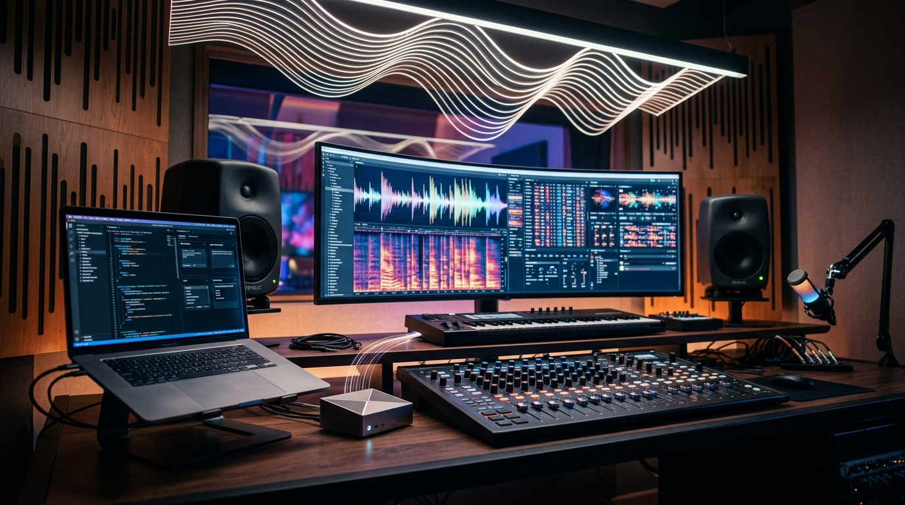

# 주간 AI 웹진 — 2026-05-02

> 이번 주 AI판, 속도전보다 워크플로 싸움이 더 뜨거웠습니다.

> 기간: 2026-04-25 ~ 2026-05-02
> 수집 건수: 65

## 이번 주 판세 요약

**이번 주는 새 모델이 튀어나온 것보다, 이미 있던 도구들이 어디까지 실무를 먹어치우는지가 더 또렷하게 보인 한 주였습니다.**

LLM 진영은 성능 숫자보다 도구 연결, 평가, 장기 실행 같은 실무 레이어를 두껍게 만드는 쪽으로 움직였습니다.

### 세 줄 요약

- 이번 주 핵심은 신모델 공개보다 기존 워크플로를 갈아끼우는 변화였습니다.
- 음악·영상 생성 툴은 프롬프트 경쟁보다 내 소스와 자산을 바로 붙여 쓰는 쪽으로 움직였습니다.
- LLM 쪽은 성능 과시보다 도구 연결, 평가, 장기 실행 같은 실무 체력 강화가 더 선명했습니다.

## LLM

이번 주 LLM은 성능표보다 운영표가 더 중요해진 주간이었습니다.

### 1. Claude for Creative Work

`2026-05-02 | 공식 발표 | Anthropic | update`

Anthropic의 Claude는 창작 전문가들에게 새로운 작업 방식을 제공합니다. 이를 통해 더 빠르고 야심 찬 아이디어를 구상하고 확장된 기술을 활용하며 대규모 프로젝트를 수행할 수 있습니다.

> 엔진 출력표보다, 자주 타는 차에 자동변속기를 달아 놓은 쪽에 더 가깝습니다.

[원문 보기](https://www.anthropic.com/news/claude-for-creative-work)

### 2. An update on our election safeguards

`2026-04-28 | 공식 발표 | Anthropic | update`

Anthropic은 다가오는 미국 중간선거를 앞두고 있습니다. 자사 AI 모델 클로드(Claude)가 정치 관련 정보에 대해 정확하고 공정하게 답변하도록 돕기 위한 노력을 구체적으로 설명했습니다.

> 엔진 출력표보다, 자주 타는 차에 자동변속기를 달아 놓은 쪽에 더 가깝습니다.

[원문 보기](https://www.anthropic.com/news/election-safeguards-update)

### 추가로 본 이슈

- 모델 자체보다 개발 워크플로 쪽에 더 가까운 공식 업데이트를 내놨습니다 (Google)
- 모델 자체보다 개발 워크플로 쪽에 더 가까운 공식 업데이트를 내놨습니다 (arabicalories)
- 놓치면 나만 손해인 ChatGPT 이미지 2.0 업데이트 소식! (aka - 뉴닉 (뉴닉)
- 애플, 클로드 사내 워크플로우 활용 드러나 - BeInCrypto (BeInCrypto)
- 앤스로픽을 신뢰할 수 있는가? - 브런치 (브런치)
- 모델 자체보다 개발 워크플로 쪽에 더 가까운 공식 업데이트를 내놨습니다 (Albato)
- 모델 자체보다 개발 워크플로 쪽에 더 가까운 공식 업데이트를 내놨습니다 (Albato)
- 모델 자체보다 개발 워크플로 쪽에 더 가까운 공식 업데이트를 내놨습니다 (LLM Leaderboard)
- 모델 자체보다 개발 워크플로 쪽에 더 가까운 공식 업데이트를 내놨습니다 (Mashable)
- 모델 자체보다 개발 워크플로 쪽에 더 가까운 공식 업데이트를 내놨습니다 (u/Arturofrfr)
- 모델 자체보다 개발 워크플로 쪽에 더 가까운 공식 업데이트를 내놨습니다 (u/enoumen)
- 모델 자체보다 개발 워크플로 쪽에 더 가까운 공식 업데이트를 내놨습니다 (u/Frequent-Football984)
- 모델 자체보다 개발 워크플로 쪽에 더 가까운 공식 업데이트를 내놨습니다 (u/ai-lover)
- 모델 자체보다 개발 워크플로 쪽에 더 가까운 공식 업데이트를 내놨습니다 (u/Equivalent_Cut_7938)
- 모델 자체보다 개발 워크플로 쪽에 더 가까운 공식 업데이트를 내놨습니다 (u/Cannon72001)
- 모델 자체보다 개발 워크플로 쪽에 더 가까운 공식 업데이트를 내놨습니다 (u/ZeroshotCraft)
- 모델 자체보다 개발 워크플로 쪽에 더 가까운 공식 업데이트를 내놨습니다 (u/broncplus)
- 모델 자체보다 개발 워크플로 쪽에 더 가까운 공식 업데이트를 내놨습니다 (u/GPTinker)
- 모델 자체보다 개발 워크플로 쪽에 더 가까운 공식 업데이트를 내놨습니다 (u/Snickers_B)
- 모델 자체보다 개발 워크플로 쪽에 더 가까운 공식 업데이트를 내놨습니다 (u/Jewst7)
- 모델 자체보다 개발 워크플로 쪽에 더 가까운 공식 업데이트를 내놨습니다 (u/RamsinJacobRealty)
- 모델 자체보다 개발 워크플로 쪽에 더 가까운 공식 업데이트를 내놨습니다 (u/AppDeveloperAsdf)
- 모델 자체보다 개발 워크플로 쪽에 더 가까운 공식 업데이트를 내놨습니다 (u/kaysersoze76)
- 모델 자체보다 개발 워크플로 쪽에 더 가까운 공식 업데이트를 내놨습니다 (u/Appropriate-Tie-6445)
- 모델 자체보다 개발 워크플로 쪽에 더 가까운 공식 업데이트를 내놨습니다 (u/Dry-Summer2807)
- 모델 자체보다 개발 워크플로 쪽에 더 가까운 공식 업데이트를 내놨습니다 (u/zabo-999)
- 모델 자체보다 개발 워크플로 쪽에 더 가까운 공식 업데이트를 내놨습니다 (Medium)
- `Caliber MCP Server (Use Caliber with AI)` 기능을 새로 꺼내 들었습니다 (u/caliber-chris)
- 모델 자체보다 개발 워크플로 쪽에 더 가까운 공식 업데이트를 내놨습니다 (u/Roses-key)
- 모델 자체보다 개발 워크플로 쪽에 더 가까운 공식 업데이트를 내놨습니다 (u/Specialist-Bee9801)
- 모델 자체보다 개발 워크플로 쪽에 더 가까운 공식 업데이트를 내놨습니다 (u/ai-lover)
- 모델 자체보다 개발 워크플로 쪽에 더 가까운 공식 업데이트를 내놨습니다 (u/RamsinJacobRealty)

## 이미지 생성

이미지 생성은 화질 과시보다 테스트를 얼마나 많이, 싸게 돌릴 수 있느냐가 더 큰 경쟁 포인트로 보였습니다.

### 1. V8.1 Updates

`2026-05-01 | 공식 발표 | Midjourney | update`

미드저니 V8.1 업데이트를 통해 이미지 선명도와 품질이 크게 향상되었습니다. 특히 SREF와 무드보드, 그리고 고화질 이미지에서 그 개선이 두드러지며, 이제 디스코드와 미드저니 공식 웹사이트에서 모두 이용할 수 있습니다. 이번 개선으로 사용자들이 생성한 이미지를 별도로 보정하는 수고가 줄어들고, 처음부터 더욱 선명하고 완성도 높은 결과물을 얻게 될 것입니다. 이는 시각 콘텐츠 제작 과정에서 효율성을 높이고, 아이디어를 더욱 정교하게 시각화하는 데 기여할 전망입니다.

> 흐릿했던 풍경에 안경을 쓴 듯 세상이 또렷해졌습니다.

[원문 보기](https://updates.midjourney.com/v8-1-updates/)

### 2. High-res rating

`2026-04-28 | 공식 발표 | Midjourney | update`

Midjourney는 v8.1/8.2 버전의 심미적 업데이트를 앞두고 있습니다. 모델의 2K 해상도 이미지 품질을 '원천적으로' 개선하기 위해 사용자들의 이미지 랭킹 참여를 독려하고 있습니다.

> 한 번 잘 나오는 필터보다, 작업실 조명이 통째로 바뀐 느낌에 가깝습니다.

[원문 보기](https://updates.midjourney.com/high-res-rating/)

### 추가로 본 이슈

- 이번 주 이미지 생성 흐름을 바꾸는 업데이트를 꺼냈습니다 (AppleInsider)
- 이번 주 이미지 생성 흐름을 바꾸는 업데이트를 꺼냈습니다 (Progressive Robot)
- 이번 주 이미지 생성 흐름을 바꾸는 업데이트를 꺼냈습니다 (AppleInsider)
- 이번 주 이미지 생성 흐름을 바꾸는 업데이트를 꺼냈습니다 (CineD)

## 영상 생성

영상 생성은 거창한 신기능 발표보다 버전 전환과 기존 작업 자산을 어떻게 이어갈지가 더 크게 보인 주간이었습니다.

### 1. Research

`2026-05-02 | 공식 발표 | Runway | update`

Runway 연구팀은 영상 생성 기술 분야에서 이뤄낸 혁신적인 논문과 데모, 그리고 여러 돌파구적 성과들을 공개했습니다. 이러한 연구 결과들은 인공지능 기반의 영상 제작이 단순한 도구를 넘어 새로운 창작의 지평을 열어가는 흐름을 가속화할 전망입니다.

> 짧은 티저 한 편보다 편집실 타임라인에 새 레일을 깔아준 셈입니다.

[원문 보기](https://runwayml.com/news/research)

### 2. Customer Stories

`2026-05-02 | 공식 발표 | Runway | update`

Runway가 영상 생성 워크플로에 바로 영향 주는 공지를 내놨습니다. 영상 쪽은 멋진 데모 한 편보다 기존 프로젝트를 계속 이어서 만들 수 있느냐가 실무 포인트입니다.

> 짧은 티저 한 편보다 편집실 타임라인에 새 레일을 깔아준 셈입니다.

[원문 보기](https://runwayml.com/news/customers)

### 추가로 본 이슈

- 영상 생성 워크플로에 바로 영향 주는 공지를 내놨습니다 (Rctv)

## 음악 생성

음악 생성 쪽은 이번 주에 유독 방향이 선명했습니다. 프롬프트 한 줄 받아 곡을 뽑는 데서 끝나는 게 아니라, 내 파일과 스타일을 바로 들고 들어오게 만드는 쪽으로 확실히 꺾였습니다.

### 1. Suno - AI Songs & Music - App Store - Apple

`2026-04-26 | 웹 검색 | App Store | update`

AI 음악 생성 앱 Suno가 버그 수정 및 성능 개선을 포함한 업데이트를 선보였습니다. 이 버전은 앱의 속도와 안정성을 위해 iOS 18 운영체제를 필수로 요구합니다.

> 멜로디 하나 얻는 수준이 아니라, 세션 파일에 자주 쓰는 악기 체인을 저장한 느낌입니다.

[원문 보기](https://apps.apple.com/us/app/suno-ai-songs-music/id6480136315)

### 2. Add and manage MCP servers in VS Code

`2026-04-25 | 웹 검색 | Visual Studio Code | update`

Visual Studio Code의 에이전트 사용자 지정 편집기(미리 보기)가 업데이트되며, MCP 서버를 한곳에서 검색하고 생성하며 관리하는 기능이 통합되었습니다. 음악 생성은 한 곡 뽑기보다 소스 입력, 스타일 유지, 후반 작업 연결성이 시간을 아껴줍니다.

> 멜로디 하나 얻는 수준이 아니라, 세션 파일에 자주 쓰는 악기 체인을 저장한 느낌입니다.

[원문 보기](https://code.visualstudio.com/docs/copilot/customization/mcp-servers)

### 추가로 본 이슈

- 음악 생성에서 손이 많이 가던 구간을 줄이는 기능을 내놨습니다 (Music Business Worldwide)

## 편집/제작

편집/제작 쪽은 새 버튼 하나보다 실제 반복 공정을 얼마나 덜어주느냐가 포인트입니다.

### 1. Firefly AI Assistant now available in public beta

`2026-04-28 | 웹 검색 | Adobe | update`

어도비가 Firefly AI Assistant를 공개 베타로 출시했습니다. 이 AI는 사용자의 지시에 따라 포토샵, 프리미어, 파이어플라이 등 여러 크리에이티브 애플리케이션의 작업을 능숙하게 조율합니다.

> 새 버튼 하나보다 반복 클릭을 매크로로 묶어버린 쪽에 더 가깝습니다.

[원문 보기](https://blog.adobe.com/en/publish/2026/04/27/firefly-ai-assistant-public-beta)

### 2. built a custom ai writer. quietly hitting google discover now

`2026-04-30 | 커뮤니티 레이더 | u/PresenceAny7615 | update`

u/PresenceAny7615 쪽에서 이번 주 흐름을 보여주는 공식 업데이트가 나왔습니다. 편집 툴은 성능 과시보다 클릭 수를 줄이고 반복 공정을 덜어내는 쪽에서 체감 차이가 납니다.

> 새 버튼 하나보다 반복 클릭을 매크로로 묶어버린 쪽에 더 가깝습니다.

[원문 보기](https://www.reddit.com/r/buildinpublic/comments/1sz9k6g/built_a_custom_ai_writer_quietly_hitting_google/)

### 추가로 본 이슈

- 이번 주 흐름을 보여주는 공식 업데이트가 나왔습니다 (u/LastNameOn)

## 3D

3D 쪽은 멋진 결과물보다 후속 수정과 파이프라인 연결이 더 중요해진 흐름입니다.

### 1. Chicken Gun 3D Model: Free Downloads & Design Guide

`2026-04-27 | 공식 발표 | Tripo | update`

Tripo 정보에 따르면, 인기 멀티플레이어 슈터 게임 'Chicken Gun'의 독특한 캐릭터 3D 모델을 찾는 창작자들이 많았습니다. 하지만 이 모델들을 손쉽게 구할 수 없어 불편함이 있었습니다.

> 멋진 렌더 한 장보다, 모델링 책상 위에 손이 덜 가는 공구를 올린 셈입니다.

[원문 보기](https://www.tripo3d.ai/blog/explore/chicken-gun-3d-model-guide)

## 에이전트/자동화

에이전트/자동화는 데모보다 실제로 어디까지 맡길 수 있느냐가 핵심입니다.

### 1. Adobe launches Firefly AI Assistant public beta with cross-app workflow automation - 9to5Mac

`2026-04-27 | 웹 검색 | 9to5Mac | update`

어도비는 크리에이티브 클라우드 제품군 전반의 작업과 워크플로우를 조율하는 Firefly AI Assistant를 공개 베타로 출시했습니다. 이제 사용자는 여러 어플리케이션을 오가며 수동으로 처리하던 복잡한 작업 과정을 인공지능이 대신 처리하게 하여 창작 효율을 크게 높일 수 있습니다.

> 똑똑한 비서 한 명보다, 자주 하던 심부름에 전용 동선을 깔아 놓은 느낌입니다.

[원문 보기](https://9to5mac.com/2026/04/27/adobe-launches-firefly-ai-assistant-public-beta-with-cross-app-workflow-automation/)

### 2. What's New in Cursor — Latest Updates & Release Notes

`2026-04-29 | 웹 검색 | Cursor | update`

Cursor는 Bugbot에 실시간 자체 개선 기능과 MCP 지원을 추가하고 Bugbot Autofix를 개선했으며, 코드 블록이 많은 에이전트 대화에서 발생하던 화면 깜빡임 및 멈춤 버그를 수정했습니다. 버그봇이 실시간으로 스스로 학습하며 문제를 해결하는 능력은 개발 과정에서 버그 수정의 자동화 수준을 한층 끌어올려, 개발자들이 반복적인 디버깅에 소모하는 시간을 크게 줄여줄 것으로 예상됩니다.

> 마치 스스로 성장하며 오류를 고쳐주는 똑똑한 조수를 얻은 것과 같습니다.

[원문 보기](https://cursor.com/changelog)

### 추가로 본 이슈

- 이번 주 흐름을 보여주는 공식 업데이트가 나왔습니다 (Julian Goldie)
- 이번 주 흐름을 보여주는 공식 업데이트가 나왔습니다 (u/ShilpaMitra)
- 이번 주 흐름을 보여주는 공식 업데이트가 나왔습니다 (u/InterstellarKinetics)
- 이번 주 흐름을 보여주는 공식 업데이트가 나왔습니다 (u/glazecl)
- 이번 주 흐름을 보여주는 공식 업데이트가 나왔습니다 (u/Chance-Roll-2408)
- 이번 주 흐름을 보여주는 공식 업데이트가 나왔습니다 (u/Right_Pea_2707)
- 이번 주 흐름을 보여주는 공식 업데이트가 나왔습니다 (u/softtechhubus)
- 이번 주 흐름을 보여주는 공식 업데이트가 나왔습니다 (u/RamsinJacobRealty)
- 이번 주 흐름을 보여주는 공식 업데이트가 나왔습니다 (u/AutoModerator)
- 이번 주 흐름을 보여주는 공식 업데이트가 나왔습니다 (u/the_rizzler80085)
- 이번 주 흐름을 보여주는 공식 업데이트가 나왔습니다 (u/Any_Good_2682)
- 이번 주 흐름을 보여주는 공식 업데이트가 나왔습니다 (u/siropkin)

## 지금 많이 보는 AI 유튜브

이번 주 이슈랑 같이 보면 맥락 잡기 좋은 영상 3개만 골랐습니다. 뉴스형 브리핑 위주로 넣었습니다.

### 1. AI News: 18 Breaking Stories You Missed This Week

`2026-05-01 | YouTube | Matt Wolfe | 2.1만회`

이번 주 AI 업데이트를 한 번에 훑기 좋은 브리핑형 영상입니다.

[원문 보기](https://www.youtube.com/watch?v=qDI4odijz44)

### 2. AI News: The Biggest Leap We've Seen This Year!

`2026-04-24 | YouTube | Matt Wolfe | 11.6만회`

이번 주 AI 업데이트를 한 번에 훑기 좋은 브리핑형 영상입니다.

[원문 보기](https://www.youtube.com/watch?v=jsP-eRriC0k)
